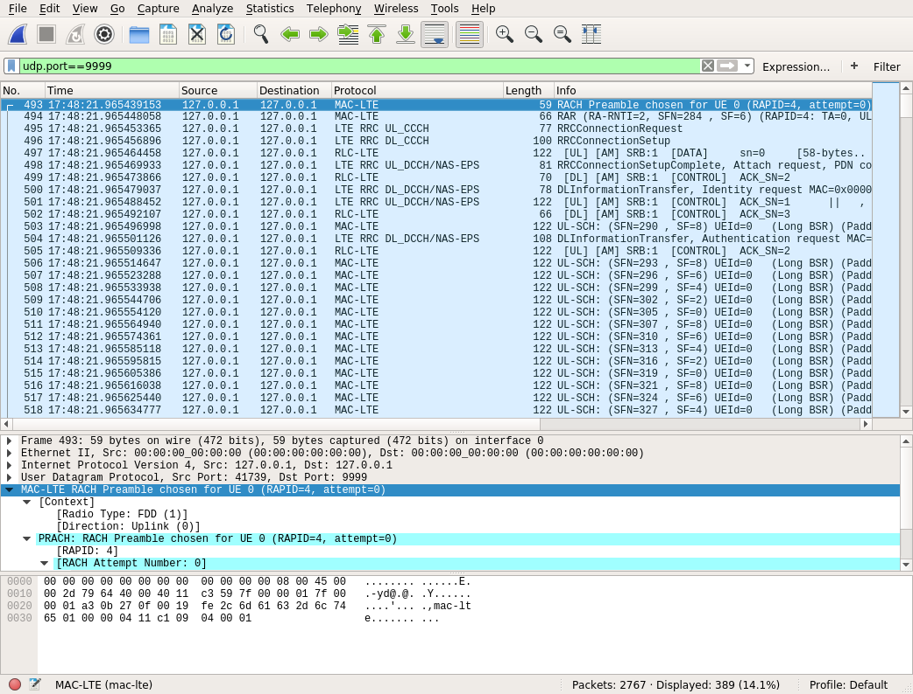

# MAC PDUs and wireshark

First, read the [basic usage](./basic.md) to compile things.

It is possible to use `wireshark` to analyse MAC PDUs for UEs,
MIBs, SIBs, and random accesses seen by the eNodeB.

## Live usage

Launch wireshark and listen on the local interface (lo).
Set the filter to `udp.port==9999` and read below
for configuration.

Run the softmodem with the correct command line arguments
(see [basic usage](./basic.md)).

Then run:

```shell
./macpdu2wireshark -d ../T_messages.txt -live
```

For other options of `macpdu2wireshark`, run:

```shell
./macpdu2wireshark -h
```

You can for example disable MIB and SIB logging, or log only
a given number of them.

## Record and replay

You need to record some specific traces. As of 2018-10-30
you have to use the group:
* `WIRESHARK`

That is, run:

```shell
./record -d ../T_messages.txt -o /tmp/record.raw -on WIRESHARK
```

With a recorded trace you then use `macpdu2wireshark`.

## Example

Download [example.raw](example.raw). This example contains
MIBs, SIBs and a connection made by an UE followed  by its
disconnection.

First step is to extract `T_messages.txt` from this trace.

```shell
./extract_config -i example.raw > extracted_T_messages.txt
```

Then you run `wireshark`, capture on `lo` and set the
filter to `udp.dstport==9999`.

While `wireshark` is running, you do:

```shell
./macpdu2wireshark -d extracted_T_messages.txt -i example.raw -no-mib -no-sib
```

In `wireshark` you should see something similar to the following:



## Configure wireshark for LTE

To dissect the packets, you need to configure `wireshark`.

In the menu, choose `Edit->Preferences`.

In the preference window, unroll `Protocols`.

Go to `UDP` and activate `Try heuristic sub-dissectors first`.

Depending on your version of `wireshark`, you may need to go to `MAC-LTE`
and activate `Try Heuristic LTE-MAC over UDP framing` if this option
is present.

For newer versions (after 2.0 as says wireshark's documentation),
heuristic activation is moved to the `Enabled Protocols` window
(in the menu `Analyze`). In the `enabled protocols` window, search
for `lte` and select `mac_lte_udp` to have `MAC-LTE over UDP`.

You may also want to configure other parameters in `MAC-LTE`,
`RLC-LTE`, `PDCP-LTE`, and maybe others. Check the documentation
of `wireshark`.

It is advised to use a recent version of wireshark (say more than 2.4).

## Configure wireshark for NR

Use a recent version of wireshark. The steps below were done using
version 3.3.2. Maybe some options are different for your version
of wireshark. Adapt as necessary.

First, do the previous steps for LTE.

Then, in the menu, choose `Edit->Preferences`.

In the preference window, unroll `Protocols`.

Go to `MAC-NR`. Select both options (`Attempt to decode BCCH, PCCH and CCCH data using NR RRC dissector`
and `Attempt to dissect LCID 1-3 as srb1-3`).

For `Source of LCID -> drb channel settings` choose option `From static table`.
Then click the `Edit...` button of `LCID -> DRB Mappings Table`.

In the new window, click on `+`. Choose LCID `4`, DRBID `1`, UL RLC Bearer
Type `AM, SN Len=18`, same thing for DL RLC Bearer Type.

Then click OK.

Now, go to `RLC-NR`. Select `Call PDCP dissector for SRB PDUs`.

For `Call PDCP dissector for UL DRB PDUs` choose `18-bit SN`. Same
for DL.

Select `Call RRC dissector for CCCH PDUs`.

You don't need to select `May see RLC headers only` and
`Try to reassemble UM frames`.

Now, go to `PDCP-NR`. Select what you want in there. It's good
to select `Show uncompressed User-Plane data as IP`. Also good
to select `Show unciphered Signalling-Plane data as RRC`.
For `Do sequence number analysis` it can be good to use
`Only-RLC-frames` but anything will do. We don't use ROHC so you
don't need to select `Attempt to decode ROHC data`. And the
layer info to show depends on what you want to analyse.
`Traffic Info` is a good choice.

You are done with the preferences. You can click OK.

Then, in the menu `Analyze`, choose `Enabled Protocols...`. In the new window
search for `nr` and select `mac_nr_udp` to have `MAC-NR over UDP`.

And that's it. Maybe other settings can be changed, but those steps should be
enough for a start.

Note: not all versions of Wireshark correctly dissect encapsulated packets. For instance, we observed that Wireshark v3.4.8 did not call the PDCP dissector for a PDCP PDU split in two RLC SDUs. On the other hand, Wireshark v3.7.0 showed it just fine.

## Alternative to wireshark

While using `macpdu2wireshark` with the `-live` option, it is possible to use `tcpdump` instead of `wireshak` to record MAC PDUs and also other types of traffic (sctp, gtp) in the same output pcap file.

A "catch all" solution is to run:

```
sudo tcpdump -n -iany "udp port 9999 or udp port 2152 or sctp or port 38462 or port 38472 or port 38412 or port 2153"  -w /tmp/rec.pcap
```

(This is an example, other solutions are also possible.)
