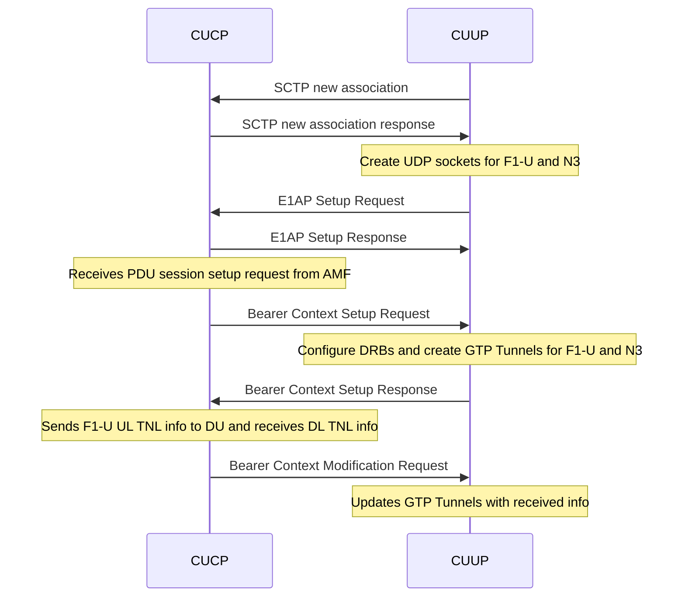
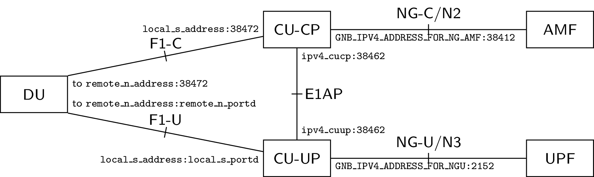

[[_TOC_]]

# 1. Introduction

E1 is named for the interface that lies between the nodes CU Control Plane (CUCP) and CU User Plane (CUUP). Once the nodes are configured, all user plane traffic flows through CUUP.

The E1 design in OAI follows the 3GPP specification in TS 38.460. The code design on E1 in OAI is very similar to
F1. The ITTI message passing mechanism is used to exchange messages between E1AP thread, SCTP thread and RRC thread.

The following sequence chart shows the current E1AP message flow.



_Note that the E1 bearer release procedures are currently not implemented._

# 2. Running the E1 Split

## 2.1 Configuration File

The gNB is started based on the node type that is specified in the configuration file. To start a gNB instance in CUCP or CUUP, the `tr_s_preference` should be set to "f1" and the config member `E1_INTERFACE` should be present in the config file. The `type` parameter within the `E1_INTERFACE` should be set to `cp`, and `nr-softmodem` should be used to run a CU-CP. The type should be `up` and `nr-cuup` should be used to run the CU-UP. Further, there are the parameters `ipv4_cucp` and `ipv4_cuup` to specify the IP addresses of the respective network functions.

For CUCP, a typical `E1_INTERFACE` config looks like
```
E1_INTERFACE =
(
  {
    type = "cp";
    ipv4_cucp = "127.0.0.4";
    ipv4_cuup = "127.0.0.5";
  }
)
```

For CUUP, it is
```
E1_INTERFACE =
(
  {
    type = "up";
    ipv4_cucp = "127.0.0.4";
    ipv4_cuup = "127.0.0.5";
  }
)
```
One could take an existing CU configuration file and add the above parameters to run the gNB as CUCP or CUUP.

The CUUP uses the IP address specified in `local_s_address` for F1-U and `GNB_IPV4_ADDRESS_FOR_NGU` for N3 links. Note that `local_s_address` is under `gNBs` and `GNB_IPV4_ADDRESS_FOR_NGU` is part of the `NETWORK_INTERFACES` config member.  

Alternatively, you can use the config files `ci-scripts/conf_files/gnb-cucp.sa.conf` and `ci-scripts/conf_files/gnb-cuup.sa.conf` which are already in the repository.

## 2.2 Steps to Run the Split in rfsimulator with OAI UE

Note: A 5G core must be running at this point. Steps to start the OAI 5G core can be found [in the oai-cn5g-fed repository](https://gitlab.eurecom.fr/oai/cn5g/oai-cn5g-fed/-/blob/master/docs/DEPLOY_HOME.md) or [here](NR_SA_CN5G_gNB_USRP_COTS_UE_Tutorial.md).

0. Open wireshark to capture the E1AP messages. You might set the capture filter
   to `sctp` to limit the number of captured packages.

1. Start the CUCP first by running the following command
```
sudo ./nr-softmodem -O ../../../ci-scripts/conf_files/gnb-cucp.sa.conf --gNBs.[0].min_rxtxtime 6 --sa
```

Note that `min_rxtxtime` should be set to `6` only when you are connecting an OAI UE to the gNB.

2. Start the CUUP and DU (in any order)

CUUP (has its own executable):
```
sudo ./nr-cuup -O ../../../ci-scripts/conf_files/gnb-cuup.sa.conf --sa
```

DU:
```
sudo ./nr-softmodem -O ../../../ci-scripts/conf_files/gNB_SA_DU.conf --rfsim --sa
```

You need to use  `--rfsim` if you are running the test with rfsimulator.

3. Start OAI UE or COTS UE.

OAI UE:
```
sudo ./nr-uesoftmodem -r 106 --numerology 1 --band 78 -C 3619200000 --rfsim --sa --rfsimulator.serveraddr 127.0.0.1
```

# 3. Configuration file IP addresses of network functions

You can also run the nodes on different machines. If you do so please change the interface parameters accordingly and make sure the interfaces are reachable. Please refer to the following figure for an overview of all parameters.

{width=1200}

[PDF version](images/e1-archi.pdf) | [LaTeX/TikZ version](img/e1-archi.tex) if you want to modify to reflect your setup
