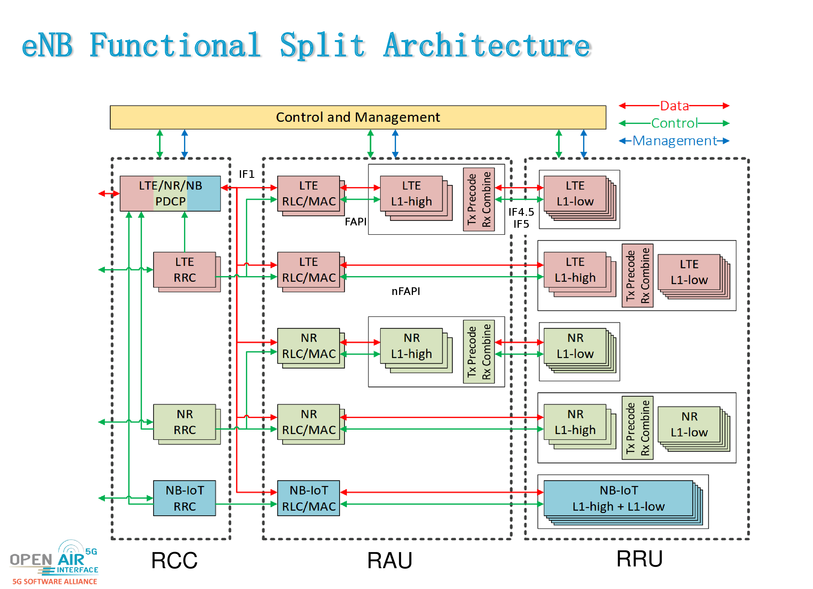
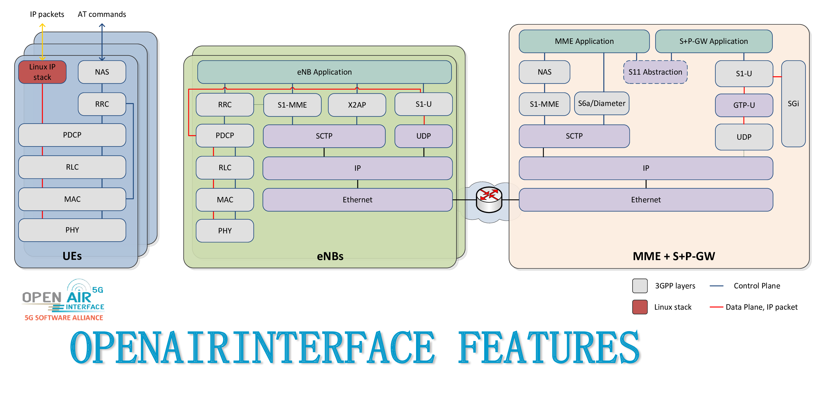

**Table of Contents**

[[_TOC_]]

# Functional Split Architecture #

-  RCC: Radio-Cloud Center
-  RAU: Radio-Access Unit
-  RRU: Remote Radio-Unit
-  IF4.5 / IF5 : similar to IEEE P1914.1
-  FAPI (IF2)  : specified by Small Cell Forum (open-nFAPI implementation)
-  IF1         : F1 in 3GPP Release 15

# OpenAirInterface Block Diagram #

# OpenAirInterface 4G LTE eNB Feature Set #

## eNB PHY Layer ##

The Physical layer implements **3GPP 36.211**, **36.212**, **36.213** and provides the following features:

- LTE release 8.6 compliant, and implements a subset of release 10
- FDD and TDD configurations: 1 (experimental) and 3
- Bandwidth: 5, 10, and 20 MHz
- Transmission modes: 1, 2 (stable), 3, 4, 5, 6, 7 (experimental)
- Max number of antennas: 2
- CQI/PMI reporting: aperiodic, feedback mode 3 - 0 and 3 - 1
- PRACH preamble format 0
- Downlink (DL) channels are supported: PSS, SSS, PBCH, PCFICH, PHICH, PDCCH, PDSCH, PMCH, MPDCCH
- Uplink (UL) channels are supported: PRACH, PUSCH, PUCCH (format 1/1a/1b), SRS, DRS
- HARQ support (UL and DL)
- Highly optimized base band processing (including turbo decoder)
- Multi-RRU support: over the air synchro b/ multi RRU in TDD mode
- Support for CE-modeA for LTE-M. Limited support for repeatition, single-LTE-M connection, legacy-LTE UE attach is disabled.

### Performances ###

**Transmission Mode, Bandwidth** | **Expected Throughput** | **Measured Throughput** | **Measurement Conditions**
-------------------------------- | ----------------------- | ------------------------| ----------------:
FDD DL: 5 MHz, 25 PRBS/ MCS 28   | 16 - 17 Mbit/s          | TM1: 17.0 Mbits/s       | COTS-UE Cat 4 (150/50 Mbps)
FDD DL: 10 MHz, 50 PRBS/ MCS 28  | 34 - 35 Mbit/s          | TM1: 34.0 Mbits/s       | COTS-UE Cat 4 (150/50 Mbps)
FDD DL: 20 MHz, 100 PRBS/ MCS 28 | 70 Mbit/s               | TM1: 69.9 Mbits/s       | COTS-UE Cat 4 (150/50 Mbps)
 |  |  | 
FDD UL: 5 MHz, 25 PRBS/ MCS 20   | 9 Mbit/s                | TM1: 8.28 Mbits/s       | COTS-UE Cat 4 (150/50 Mbps)
FDD UL: 10 MHz, 50 PRBS/ MCS 20  | 17 Mbit/s               | TM1: 18.3 Mbits/s       | COTS-UE Cat 4 (150/50 Mbps)
FDD UL: 20 MHz, 100 PRBS/ MCS 20 | 35 Mbit/s               | TM1: 18.6 Mbits/s       | COTS-UE Cat 4 (150/50 Mbps)
 |  | 
TDD DL: 5 MHz, 25 PRBS/ MCS **XX**   | 6.5 Mbit/s          | TM1: 6.71 Mbits/s       | COTS-UE Cat 4 (150/50 Mbps)
TDD DL: 10 MHz, 50 PRBS/ MCS **XX**  | 13.5 Mbit/s         | TM1: 13.6 Mbits/s       | COTS-UE Cat 4 (150/50 Mbps)
TDD DL: 20 MHz, 100 PRBS/ MCS **XX** | 28.0 Mbit/s         | TM1: 27.2 Mbits/s       | COTS-UE Cat 4 (150/50 Mbps)
 |  | | 
TDD UL: 5 MHz, 25 PRBS/ MCS **XX**   | 2.0 Mbit/s          | TM1: 3.31 Mbits/s       | COTS-UE Cat 4 (150/50 Mbps)
TDD UL: 10 MHz, 50 PRBS/ MCS **XX**  | 2.0 Mbit/s          | TM1: 7.25 Mbits/s       | COTS-UE Cat 4 (150/50 Mbps)
TDD UL: 20 MHz, 100 PRBS/ MCS **XX** | 3.0 Mbit/s          | TM1: 4.21 Mbits/s       | COTS-UE Cat 4 (150/50 Mbps)

### Number of supported UEs ###

* 16 by default
* up to 256 when compiling with dedicated compile flag
* was tested with 40 COTS-UE

## eNB MAC Layer ##

The MAC layer implements a subset of the **3GPP 36.321** release v8.6 in support of BCH, DLSCH, RACH, and ULSCH channels. 

- RRC interface for CCCH, DCCH, and DTCH
- Proportional fair scheduler (round robin scheduler soon), with the following improvements:
	- Up to 30 users tested in the L2 simulator, CCE allocation in the preprocessor ; the scheduler was also simplified and made more modular
	- Adaptative UL-HARQ
	- Remove out-of-sync UEs
	- No use of the `first_rb` in the UL scheduler ; respects `vrb_map_UL` and `vrb_map` in the DL
- DCI generation
- HARQ Support
- RA procedures and RNTI management
- RLC interface (AM, UM)
- UL power control
- Link adaptation
- Connected DRX (CDRX) support for FDD LTE UE. Compatible with R13 from 3GPP. Support for Cat-M1 UE comming soon.

## eNB RLC Layer ##

The RLC layer implements a full specification of the 3GPP 36.322 release v9.3.

- RLC TM (mainly used for BCCH and CCCH) 
  * Neither segment nor concatenate RLC SDUs
  * Do not include a RLC header in the RLC PDU
  * Delivery of received RLC PDUs to upper layers
- RLC UM (mainly used for DTCH) 
  * Segment or concatenate RLC SDUs according to the TB size selected by MAC
  * Include a RLC header in the RLC PDU
  * Duplication detection
  * PDU reordering and reassembly
- RLC AM, compatible with 9.3 
  * Segmentation, re-segmentation, concatenation, and reassembly
  * Padding
  * Data transfer to the user
  * RLC PDU retransmission in support of error control and correction
  * Generation of data/control PDUs

## eNB PDCP Layer ##

The current PDCP layer is header compliant with **3GPP 36.323** Rel 10.1.0 and implements the following functions:

- User and control data transfer
- Sequence number management
- RB association with PDCP entity
- PDCP entity association with one or two RLC entities
- Integrity check and encryption using the AES and Snow3G algorithms

## eNB RRC Layer ##

The RRC layer is based on **3GPP 36.331** v15.6 and implements the following functions:

- System Information broadcast (SIB 1, 2, 3, and 13)
  * SIB1: Up to 6 PLMN IDs broadcast
- RRC connection establishment
- RRC connection reconfiguration (addition and removal of radio bearers, connection release)
- RRC connection release
- RRC connection re-establishment
- Inter-frequency measurement collection and reporting (experimental)
- eMBMS for multicast and broadcast (experimental)
- Handover (experimental)
- Paging (soon)
- RRC inactivity timer (release of UE after a period of data inactivity)

## eNB X2AP ##

The X2AP layer is based on **3GPP 36.423** v14.6.0 and implements the following functions:

 - X2 Setup Request
 - X2 Setup Response 
 - X2 Setup Failure
 - Handover Request 
 - Handover Request Acknowledge
 - UE Context Release
 - X2 timers (t_reloc_prep, tx2_reloc_overall)
 - Handover Cancel
 - X2-U interface implemented
 - EN-DC is implemented
 - X2AP : Handling of SgNB Addition Request / Addition Request Acknowledge / Reconfiguration Complete
 - RRC  : Handling of RRC Connection Reconfiguration with 5G cell info, configuration of 5G-NR measurements
 - S1AP : Handling of E-RAB Modification Indication / Confirmation 

## eNB/MCE M2AP ##

The M2AP layer is based on **3GPP 36.443** v14.0.1:
 - M2 Setup Request
 - M2 Setup Response 
 - M2 Setup Failure
 - M2 Scheduling Information
 - M2 Scheduling Information Response 
 - M2 Session Start Request
 - M2 Session Start Response

## MCE/MME M3AP ##

The M3AP layer is based on **3GPP 36.444** v14.0.1:
 - M3 Setup Request
 - M3 Setup Response 
 - M3 Setup Failure
 - M3 Session Start Request
 - M3 Session Start Response

# OpenAirInterface 4G LTE UE Feature Set #

## LTE UE PHY Layer ##

The Physical layer implements **3GPP 36.211**, **36.212**, **36.213** and provides the following features:

- LTE release 8.6 compliant, and implements a subset of release 10
- FDD and TDD configurations: 1 (experimental) and 3
- Bandwidth: 5, 10, and 20 MHz
- Transmission modes: 1, 2 (stable)
- Max number of antennas: 2
- CQI/PMI reporting: aperiodic, feedback mode 3 - 0 and 3 - 1
- PRACH preamble format 0
- All downlink (DL) channels are supported: PSS, SSS, PBCH, PCFICH, PHICH, PDCCH, PDSCH, PMCH
- All uplink (UL) channels are supported: PRACH, PUSCH, PUCCH (format 1/1a/1b), SRS, DRS
- LTE MBMS-dedicated cell (feMBMS) procedures subset for LTE release 14 (experimental)
- LTE non-MBSFN subframe (feMBMS) Carrier Adquistion Subframe-CAS procedures (PSS/SSS/PBCH/PDSH) (experimental)
- LTE MBSFN MBSFN subframe channel (feMBMS): PMCH (CS@1.25KHz) (channel estimation for 25MHz bandwidth) (experimental) 

## LTE UE MAC Layer ##

The MAC layer implements a subset of the **3GPP 36.321** release v8.6 in support of BCH, DLSCH, RACH, and ULSCH channels. 

- RRC interface for CCCH, DCCH, and DTCH
- HARQ Support
- RA procedures and RNTI management
- RLC interface (AM, UM)
- UL power control
- Link adaptation
- MBMS-dedicated cell (feMBMS) RRC interface for BCCH 
- eMBMS and MBMS-dedicated cell (feMBMS) RRC interface for MCCH, MTCH

## LTE UE RLC Layer ##

The RLC layer implements a full specification of the 3GPP 36.322 release v9.3.

## LTE UE PDCP Layer ##

The current PDCP layer is header compliant with **3GPP 36.323** Rel 10.1.0.

## LTE UE RRC Layer ##

The RRC layer is based on **3GPP 36.331** v14.3.0 and implements the following functions:

- System Information decoding
- RRC connection establishment
- MBMS-dedicated cell (feMBMS) SI-MBMS/SIB1-MBMS management

## LTE UE NAS Layer ##

The NAS layer is based on **3GPP 24.301** and implements the following functions:

- EMM attach/detach, authentication, tracking area update, and more
- ESM default/dedicated bearer, PDN connectivity, and more

# OpenAirInterface 5G-NR Feature Set #

## General Parameters ##

The following features are valid for the gNB and the 5G-NR UE.

*  Static TDD, 
*  FDD
*  Normal CP
*  Subcarrier spacings: 15 and 30kHz (FR1), 120kHz (FR2)
*  Bandwidths: 10, 20, 40, 80, 100MHz (273 Physical Resource Blocks)
*  Intermediate downlink and uplink frequencies to interface with IF equipment
*  Procedures for 2-layer DL MIMO
*  Slot format: 14 OFDM symbols in UL or DL
*  Highly efficient 3GPP compliant LDPC encoder and decoder (BG1 and BG2 supported)
*  Highly efficient 3GPP compliant polar encoder and decoder
*  Encoder and decoder for short blocks
*  Support for UL transform precoding (SC-FDMA)

## gNB PHY Layer ##

*  15kHz and 30kHz SCS for FR1 and 120kHz SCS for FR2
*  Generation of NR-PSS/NR-SSS
*  NR-PBCH supports multiple SSBs and flexible periodicity
*  Generation of NR-PDCCH (including generation of DCI, polar encoding, scrambling, modulation, RB mapping, etc)
   - common search space
   - user-specific search space
   - DCI formats: 00, 10, 01 and 11
*  Generation of NR-PDSCH (including Segmentation, LDPC encoding, rate matching, scrambling, modulation, RB mapping, etc).
   - PDSCH mapping type A and B
   - DMRS configuration type 1 and 2
   - Single and multiple DMRS symbols
   - PTRS support
   - Support for 1, 2 and 4 TX antennas
   - Support for up to 2 layers (currently limited to DMRS configuration type 2)
   - Support for 256 QAM
*  NR-CSIRS Generation of sequence at PHY
*  NR-PUSCH (including Segmentation, LDPC encoding, rate matching, scrambling, modulation, RB mapping, etc).
   - PUSCH mapping type A and B
   - DMRS configuration type 1 and 2
   - Single and multiple DMRS symbols
   - PTRS support
   - Support for up to 2 RX antenna
   - Support for up to 2 layers
   - Support for 256 QAM
*  NR-PUCCH 
   - Format 0 (2 bits, for ACK/NACK and SR)
   - Format 2 (mainly for CSI feedback)
*  NR-SRS
    - SRS signal reception
    - Channel estimation (with T tracer real time monitoring)
    - Power noise estimation
*  NR-PRS
    - Rel16 Positioning reference signal(PRS) generation and modulation
    - Multiple PRS resources, one per beam is supported in FR2 TDD mode
    - FR1 and FR2 support with config file
*  NR-PRACH
   - Formats 0,1,2,3, A1-A3, B1-B3
*  Highly efficient 3GPP compliant LDPC encoder and decoder (BG1 and BG2 are supported)
*  Highly efficient 3GPP compliant polar encoder and decoder
*  Encoder and decoder for short block
   
## gNB Higher Layers ##

**gNB MAC**
- MAC -> PHY configuration using NR FAPI P5 interface
- MAC <-> PHY data interface using FAPI P7 interface for BCH PDU, DCI PDU, PDSCH PDU
- Scheduler procedures for SIB1
- Scheduler procedures for RA
  - Contention Free RA procedure
  - Contention Based RA procedure
    - Msg3 can transfer uplink CCCH, DTCH or DCCH messages
    - CBRA can be performed using MAC CE or C-RNTI
- Scheduler procedures for CSI-RS
- MAC downlink scheduler
  - phy-test scheduler (fixed allocation and usable also without UE)
  - regular scheduler with dynamic allocation
  - MCS adaptation from HARQ BLER
- MAC header generation (including timing advance)
- ACK / NACK handling and HARQ procedures for downlink
- MAC uplink scheduler
  - phy-test scheduler (fixed allocation)
  - regular scheduler with dynamic allocation
  - HARQ procedures for uplink
- Scheduler procedures for SRS reception
  - Periodic SRS reception
  - Channel rank computation up to 2x2 scenario
  - TPMI computation based on SRS up 4 antenna ports and 2 layers
- MAC procedures to handle CSI measurement report
  - evalution of RSRP report
  - evaluation of CQI report
- MAC scheduling of SR reception
- Bandwidth part (BWP) operation
  - Handle multiple dedicated BWPs
  - BWP switching through RRCReconfiguration method

**gNB RLC**
- Send/Receive operations according to 38.322 Rel.16
  - Segmentation and reassembly procedures
  - RLC Acknowledged mode supporting PDU retransmissions
  - RLC Unacknowledged mode
  - DRBs and SRBs establishment/handling and association with RLC entities 
  - Timers implementation
  - Interfaces with PDCP, MAC 
  - Interfaces with gtp-u (data Tx/Rx over F1-U at the DU)

**gNB PDCP**
- Send/Receive operations according to 38.323 Rel.16
  - Integrity protection and ciphering procedures
  - Sequence number management, SDU dicard and in-order delivery
  - Radio bearer establishment/handling and association with PDCP entities
  - Interfaces with RRC, RLC 
  - Interfaces with gtp-u (data Tx/Rx over N3 and F1-U interfaces)

**gNB SDAP**
- Send/Receive operations according to 37.324 Rel.15
  - Establishment/Handling of SDAP entities.
  - Transfer of User Plane Data
  - Mapping between a QoS flow and a DRB for both DL and UL
  - Marking QoS flow ID in both DL and UL packets
  - Reflective QoS flow to DRB mapping for UL SDAP data PDUs

**gNB RRC**
- NR RRC (38.331) Rel 16 messages using new asn1c 
- LTE RRC (36.331) also updated to Rel 15 
- Generation of CellGroupConfig (for eNB) and MIB
- Generation of system information block 1 (SIB1)
- Generation of system information block 2 (SIB2)
- Application to read configuration file and program gNB RRC
- RRC can configure PDCP, RLC, MAC
- Interface with gtp-u (tunnel creation/handling for S1-U (NSA), N3 (SA) interfaces)
- Integration of RRC messages and procedures supporting UE 5G SA connection
  - RRCSetupRequest/RRCSetup/RRCSetupComplete
  - RRC Uplink/Downlink Information transfer carrying NAS messages transparently
  - RRC Reconfiguration/Reconfiguration complete
  - RRC Reestablishment/Reestablishment complete
  - Paging
  - Support for master cell group configuration
  - Interface with NGAP for the interactions with the AMF
  - Interface with F1AP for CU/DU split deployment option
  - Periodic RRC measurements of serving cell (no A/B events)

**gNB X2AP**
- Integration of X2AP messages and procedures for the exchanges with the eNB over X2 interface supporting the NSA setup according to 36.423 Rel. 15
  - X2 setup with eNB
  - Handling of SgNB Addition Request / Addition Request Acknowledge / Reconfiguration Complete 

**gNB NGAP**

- Integration of NGAP messages and procedures for the exchanges with the AMF over N2 interface according to 38.413 Rel. 15
  - NGAP Setup request/response
  - NGAP Initial UE message
  - NGAP Initial context setup request/response
  - NGAP Downlink/Uplink NAS transfer
  - NGAP UE context release request/complete
  - NGAP UE radio capability info indication
  - NGAP PDU session resource setup request/response
- Interface with RRC

**gNB F1AP**

- Integration of F1AP messages and procedures for the control plane exchanges between the CU and DU entities according to 38.473 Rel. 16
  - F1 Setup request/response
  - F1 DL/UL RRC message transfer
  - F1 Initial UL RRC message transfer
  - F1 UE Context setup request/response
  - F1 gNB CU configuration update
- Interface with RRC
- Interface with gtp-u (tunnel creation/handling for F1-U interface)

**gNB GTP-U**
- New gtp-u implementation supporting both N3 and F1-U interfaces according to 29.281 Rel.15
  - Interfaces with RRC, F1AP for tunnel creation
  - Interfaces with PDCP and RLC for data send/receive at the CU and DU respectively (F1-U interface)
  - Interface with SDAP for data send/receive, capture of GTP-U Optional Header, GTP-U Extension Header and PDU Session Container.

# OpenAirInterface 5G-NR UE Feature Set #

* Supporting "noS1" mode (DL and UL):
  - Creates TUN interface to PDCP to inject and receive user-place traffic
  - No connection to the core network
* Supporting Standalone (SA) mode:
  - UE can register with the 5G Core Network, establish a PDU Session and exchange user-plane traffic

##  NR UE PHY Layer ##

*  Initial synchronization
   - the UE needs to know the position in frequency of the SSBs (via command line parameter in SA)
*  Time tracking based on PBCH DMRS
*  Frequency offset estimation based on PSS and SSS
*  15kHz and 30kHz SCS for FR1 and 120 kHz SCS for FR2
*  Reception of NR-PSS/NR-SSS
*  NR-PBCH supports multiple SSBs and flexible periodicity
   - RSRP measurement for the strongest SSB
*  Reception of NR-PDCCH (including reception of DCI, polar decoding, de-scrambling, de-modulation, RB de-mapping, etc)
   - common search space configured by MIB
   - user-specific search space configured by RRC
   - DCI formats: 00, 10, 01 and 11
*  Reception of NR-PDSCH (including Segmentation, LDPC decoding, rate de-matching, de-scrambling, de-modulation, RB de-mapping, etc).
   - PDSCH mapping type A and B
   - DMRS configuration type 1 and 2
   - Single and multiple DMRS symbols
   - PTRS support
   - Support for 1, 2 and 4 RX antennas
   - Support for up to 2 layers (currently limited to DMRS configuration type 2)
* Measurements based on NR-CSIRS
   - RSRP measurements
   - RI, PMI and CQI computation
   - Support for up to 4 RX antennas
   - Support for up to 2 layers
*  NR-PUSCH (including Segmentation, LDPC encoding, rate matching, scrambling, modulation, RB mapping, etc).
   - PUSCH mapping type A and B
   - DMRS configuration type 1 and 2
   - Single and multiple DMRS symbols
   - PTRS support
   - Support for up to 2 TX antenna
   - Support for up to 2 layers
*  NR-PUCCH 
   - Format 0 (2 bits for ACK/NACK and SR)
   - Format 2 (mainly for CSI feedback)
   - Format 1 (limited testing)
   - Format 3 and 4 present but old code never tested (need restructuring before verification)
* NR-SRS
   - Generation of sequence at PHY
   - SRS signal transmission
* NR-PRS
   - PRS based Channel estimation with T tracer dumps
   - Time of arrival(ToA) estimation based on channel impulse response(CIR)
   - Finer ToA estimation by 16x oversampled IDFT for CIR
   - Support for multiple gNB reception with gNBs synced via GPSDO
* NR-PRACH
   - Formats 0,1,2,3, A1-A3, B1-B3
*  Highly efficient 3GPP compliant LDPC encoder and decoder (BG1 and BG2 are supported)
*  Highly efficient 3GPP compliant polar encoder and decoder
*  Encoder and decoder for short block

## NR UE FAPI ##

*  MAC -> PHY configuration via UE FAPI P5 interface
*  Basic MAC to control PHY via UE FAPI P7 interface
*  PHY -> MAC indication (needs some improvement)

## NR UE Higher Layers ##

**UE MAC**
* Minimum system information (MSI)
   - MIB processing
   - Scheduling of system information block 1 (SIB1) reception
* Random access procedure (needs improvement, there is still not a clear separation between MAC and PHY)
   - Mapping SSBs to multiple ROs
   - Scheduling of PRACH
   - Processing of RAR
   - Transmission and re-transmission of Msg3
   - Msg4 and contention resolution
* DCI processing
   - format 10 (RA-RNTI, C-RNTI, SI-RNTI, TC-RNTI)
   - format 00 (C-RNTI, TC-RNTI)
   - format 11 (C-RNTI)
   - format 01 (C-RNTI)
* UCI processing
   - ACK/NACK processing
   - Triggering periodic SR
   - CSI measurement reporting
* DLSCH scheduler
   - Configuration of fapi PDU according to DCI
   - HARQ procedures
* ULSCH scheduler
   - Configuration of fapi PDU according to DCI
* NR-CSIRS scheduler
  - Scheduling of NR-CSIRS reception
  - Fill UCI for CSI measurement reporting
* Scheduler procedures for SRS transmission
   - Periodic SRS transmission
* Bandwidth part (BWP) operation
   - Operation in configured dedicated BWP through RRCSetup or RRCReconfiguration

**UE RLC**
* Tx/Rx operations according to 38.322 Rel.16
   - Segmentation and reassembly procedures
   - RLC Acknowledged mode supporting PDU retransmissions
   - RLC Unacknowledged mode
   - DRBs and SRBs establishment and handling 
   - Timers implementation
   - Interfaces with PDCP, MAC

**UE PDCP**
* Tx/Rx operations according to 38.323 Rel.16
   - Integrity protection and ciphering procedures
   - Sequence number management, SDU dicard and in-order delivery
   - Radio bearer establishment/handling and association with PDCP entities
   - Interfaces with RRC, RLC 

**UE SDAP**
*  Tx/Rx operations operations according to 37.324 Rel.15
  - Establishment/Handling of SDAP entities.
  - Transfer of User Plane Data
  - Reflective Mapping
  - RRC Signaling Mapping

**UE RRC**
* Integration of RRC messages and procedures supporting UE 5G SA connection according to 38.331 Rel.16 
   - RRCSetupRequest/RRCSetup/RRCSetupComplete
   - RRC Uplink/Downlink Information transfer carrying NAS messages transparently
   - RRC Reconfiguration/Reconfiguration complete
   - Support for master cell group configuration
   - Reception of UECapabilityEnquiry, encoding and transmission of UECapability
* Interface with PDCP: configuration, DCCH and CCCH message handling
* Interface with RLC and MAC for configuration

**UE NAS**
* Transfer of NAS messages between the AMF and the UE supporting the UE registration with the core network and the PDU session  establishment according to 24.501 Rel.16
  - Identity Request/Response
  - Authentication Request/Response
  - Security Mode Command/Complete
  - Registration Request/Accept/Complete
  - PDU Session Establishment Request/Accept
  - NAS configuration and basic interfacing with RRC

[OAI wiki home](https://gitlab.eurecom.fr/oai/openairinterface5g/wikis/home)

[OAI softmodem build procedure](BUILD.md)

[Running the OAI softmodem ](RUNMODEM.md)
