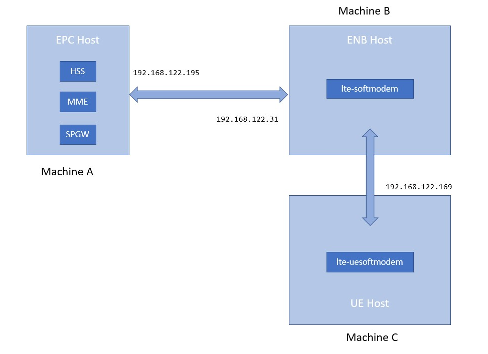

<table style="border-collapse: collapse; border: none;">
  <tr style="border-collapse: collapse; border: none;">
    <td style="border-collapse: collapse; border: none;">
      <a href="http://www.openairinterface.org/">
         
         </img>
      </a>
    </td>
    <td style="border-collapse: collapse; border: none; vertical-align: center;">
      <b><font size = "5">L2 nFAPI Simulator (with S1 / 2-host deployment)</font></b>
    </td>
  </tr>
</table>

**2022/03/08: CAUTION, THIS TUTORIAL IS NO LONGER VALID on the `develop` branch after the `2022.w01` tag.**

**2022/03/08: CAUTION, THE LAST VALID TAG on `develop` branch is `2021.w51_c`.**

**Table of Contents**

[[_TOC_]]

# 1. Environment #

3 servers are used in this deployment. You can use Virtual Machines instead of each server; like it is done in the CI process.

*  Machine A contains the EPC.
*  Machine B contains the OAI eNB executable (`lte-softmodem`)
*  Machine C contains the OAI UE(s) executable (`lte-uesoftmodem`)

Example of L2 nFAPI Simulator testing environment:



Note that the IP addresses are indicative and need to be adapted to your environment.

# 2. Prepare the EPC #

Create the environment for the EPC and register all **USIM** information into the **HSS** database.

If you are using OAI-EPC ([see on GitHub](https://github.com/OPENAIRINTERFACE/openair-epc-fed)), build **HSS/MME/SPGW** and create config files.

# 3. Retrieve the OAI eNB-UE source code #

At the time of writing, the tag used in the `develop` branch to do this documentation was `2020.w16`.

The tutorial should be valid for the `master` branch tags such as `v1.2.0` or `v1.2.1`. But you may face issues that could be fixed in newer `develop` tags.

Please try to use the same commit ID on both eNB/UE hosts.

```bash
$ ssh sudousername@machineB
git clone https://gitlab.eurecom.fr/oai/openairinterface5g.git enb_folder
cd enb_folder
git checkout develop
```

```bash
$ ssh sudousername@machineC
git clone https://gitlab.eurecom.fr/oai/openairinterface5g.git ue_folder
cd ue_folder
git checkout develop
```

# 4. Setup of the USIM information in UE folder #

```bash
$ ssh sudousername@machineC
cd ue_folder
# Edit openair3/NAS/TOOLS/ue_eurecom_test_sfr.conf with your preferred editor
```

Edit the USIM information within this file in order to match the HSS database. They **HAVE TO** match:

*  PLMN+MSIN and IMSI of users table of HSS database **SHALL** be the same.
*  OPC of this file and OPC of users table of HSS database **SHALL** be the same.
*  USIM_API_K of this file and the key of users table of HSS database **SHALL** be the same.

When testing multiple UEs, it is necessary to add other UEs information like described below for 2 Users. Only UE0 (first UE) information is written in the original file.

```
UE0:
{
    USER: {
        IMEI="356113022094149";
        MANUFACTURER="EURECOM";
        MODEL="LTE Android PC";
        PIN="0000";
    };

    SIM: {
        MSIN="0000000001";  // <-- Modify here
        USIM_API_K="8baf473f2f8fd09487cccbd7097c6862";
        OPC="e734f8734007d6c5ce7a0508809e7e9c";
        MSISDN="33611123456";
    };
...
};
// Copy the UE0 and edit
UE1: // <- Edit here
{
    USER: {
        IMEI="356113022094149";
        MANUFACTURER="EURECOM";
        MODEL="LTE Android PC";
        PIN="0000";
    };

    SIM: {
        MSIN="0000000002";  // <-- Modify here
        USIM_API_K="8baf473f2f8fd09487cccbd7097c6862";
        OPC="e734f8734007d6c5ce7a0508809e7e9c";
        MSISDN="33611123456";
    };
...
};
```

You can repeat the operation for as many users you want to test with.

# 5. Setup of the Configuration files #

**CAUTION: both proposed configuration files resides in the ci-scripts realm. You can copy them but you CANNOT push any modification on these 2 files as part of an MR without informing the CI team.**

## 5.1. The eNB Configuration file ##

```bash
$ ssh sudousername@machineB
cd enb_folder
# Edit ci-scripts/conf_files/rcc.band7.tm1.nfapi.conf with your preferred editor
```

First verify the nFAPI interface setup on the physical ethernet interface of machineB and put the proper IP addresses for both hosts.

```
MACRLCs = (
        {
        num_cc = 1;
        local_s_if_name  = "ens3";             // <-- HERE
        remote_s_address = "192.168.122.169";  // <-- HERE
        local_s_address  = "192.168.122.31";   // <-- HERE
        local_s_portc    = 50001;
        remote_s_portc   = 50000;
        local_s_portd    = 50011;
        remote_s_portd   = 50010;
        tr_s_preference = "nfapi";
        tr_n_preference = "local_RRC";
        }
);
```

If you are testing more than 16 UEs, a proper setting on the RUs is necessary. **Note that this part is NOT present in the original configuration file**.

```
RUs = (
    {
       local_rf       = "yes"
         nb_tx          = 1
         nb_rx          = 1
         att_tx         = 20
         att_rx         = 0;
         bands          = [38];
         max_pdschReferenceSignalPower = -23;
         max_rxgain                    = 116;
         eNB_instances  = [0];
    }
);
```

Last, the S1 interface shall be properly set.

```
    ////////// MME parameters:
    mme_ip_address      = ( { ipv4       = "CI_MME_IP_ADDR"; // replace with 192.168.122.195
                              ipv6       = "192:168:30::17";
                              active     = "yes";
                              preference = "ipv4";
                            }
                          );

    NETWORK_INTERFACES :
    {
        ENB_INTERFACE_NAME_FOR_S1_MME            = "ens3";            // replace with the proper interface name
        ENB_IPV4_ADDRESS_FOR_S1_MME              = "CI_ENB_IP_ADDR";  // replace with 192.168.122.31
        ENB_INTERFACE_NAME_FOR_S1U               = "ens3";            // replace with the proper interface name
        ENB_IPV4_ADDRESS_FOR_S1U                 = "CI_ENB_IP_ADDR";  // replace with 192.168.122.31
        ENB_PORT_FOR_S1U                         = 2152; # Spec 2152
        ENB_IPV4_ADDRESS_FOR_X2C                 = "CI_ENB_IP_ADDR";  // replace with 192.168.122.31
        ENB_PORT_FOR_X2C                         = 36422; # Spec 36422

    };
```

## 5.2. The UE Configuration file ##

```bash
$ ssh sudousername@machineB
cd ue_folder
# Edit ci-scripts/conf_files/nrue.uicc.conf with your preferred editor
```

Verify the nFAPI interface setup on the loopback interface.

```
L1s = (
        {
        num_cc = 1;
        tr_n_preference = "nfapi";
        local_n_if_name  = "ens3";            // <- HERE
        remote_n_address = "192.168.122.31";  // <- HERE
        local_n_address  = "192.168.122.169"; // <- HERE
        local_n_portc    = 50000;
        remote_n_portc   = 50001;
        local_n_portd    = 50010;
        remote_n_portd   = 50011;
        }
);
```

# 6. Build OAI UE and eNodeB #

See [Build documentation](./BUILD.md).

# 7. Start EPC #

Start the EPC on machine `A`.

```bash
$ ssh sudousername@machineA
# Start the EPC
```

# 8. Start the eNB #

In the first terminal (the one you used to build the eNB):

```bash
$ ssh sudousername@machineB
cd enb_folder/cmake_targets
sudo -E ./ran_build/build/lte-softmodem -O ../ci-scripts/conf_files/rcc.band7.tm1.nfapi.conf > enb.log 2>&1
```

If you don't use redirection, you can test but many logs are printed on the console and this may affect performance of the L2-nFAPI simulator.

We do recommend the redirection in steady mode once your setup is correct.

# 9. Start the UE #

In the second terminal (the one you used to build the UE):

```bash
$ ssh sudousername@machineC
cd ue_folder/cmake_targets
# Test 64 UEs, 1 thread in FDD mode
sudo -E ./ran_build/build/lte-uesoftmodem -O ../ci-scripts/conf_files/nrue.uicc.conf --L2-emul 3 --num-ues 64 --nums_ue_thread 1 > ue.log 2>&1
# Test 64 UEs, 1 thread in TDD mode
sudo -E ./ran_build/build/lte-uesoftmodem -O ../ci-scripts/conf_files/nrue.uicc.conf --L2-emul 3 --num-ues 64 --nums_ue_thread 1 -T 1 > ue.log 2>&1
# The "-T 1" option means TDD config
```

-   The number of UEs can set by using `--num-ues` option and the maximum UE number is 255 (with the `--mu*` options, otherwise 16).
-   The number of threads can set with the `--nums-ue-thread`. This number **SHALL NOT** be greater than the number of UEs.
    * At the time of writing, it seems to be enough to run on a single thread.
-   How many UE that can be tested depends on hardware (server , PC, etc) performance in your environment.

For example, running with 4 UEs:

```bash
$ ssh sudousername@machineC
cd ue_folder/cmake_targets
sudo -E ./ran_build/build/lte-uesoftmodem -O ../ci-scripts/conf_files/nrue.uicc.conf --L2-emul 3 --num-ues 64 --nums_ue_thread 1 > ue.log 2>&1
sleep 10
ifconfig
ens3      Link encap:Ethernet  HWaddr XX:XX:XX:XX:XX:XX
          inet addr:192.168.122.169  Bcast:192.168.122.255  Mask:255.255.255.0
....
oaitun_ue1 Link encap:UNSPEC  HWaddr 00-00-00-00-00-00-00-00-00-00-00-00-00-00-00-00
          inet addr:192.172.0.2  P-t-P:192.172.0.2  Mask:255.255.255.0
....
oaitun_ue2 Link encap:UNSPEC  HWaddr 00-00-00-00-00-00-00-00-00-00-00-00-00-00-00-00
          inet addr:192.172.0.3  P-t-P:192.172.0.3  Mask:255.255.255.0
....
oaitun_ue3 Link encap:UNSPEC  HWaddr 00-00-00-00-00-00-00-00-00-00-00-00-00-00-00-00
          inet addr:192.172.0.4  P-t-P:192.172.0.4  Mask:255.255.255.0
....
oaitun_ue4 Link encap:UNSPEC  HWaddr 00-00-00-00-00-00-00-00-00-00-00-00-00-00-00-00
          inet addr:192.172.0.5  P-t-P:192.172.0.5  Mask:255.255.255.0
....
oaitun_uem1 Link encap:UNSPEC  HWaddr 00-00-00-00-00-00-00-00-00-00-00-00-00-00-00-00
          inet addr:10.0.2.2  P-t-P:10.0.2.2  Mask:255.255.255.0
....
....
```

Having the 4 oaitun_ue tunnel interfaces up and with an allocated address means the connection with EPC went alright.

# 10. Test with ping #

In a third terminal, after around 10 seconds, the UE(s) shall be connected to the eNB: Check with ifconfig

```bash
$ ssh sudousername@machineA
# Ping UE1 IP address based on the EPC pool used: in this example:
$ ping -c 20 192.172.0.2
# Ping UE4 IP address based on the EPC pool used: in this example:
$ ping -c 20 192.172.0.5
```

iperf operations can also be performed.

# 11. Limitations #


----

[oai wiki home](https://gitlab.eurecom.fr/oai/openairinterface5g/wikis/home)

[oai softmodem features](FEATURE_SET.md)

[oai softmodem build procedure](BUILD.md)

[L2 nfapi simulator](L2NFAPI.md)
