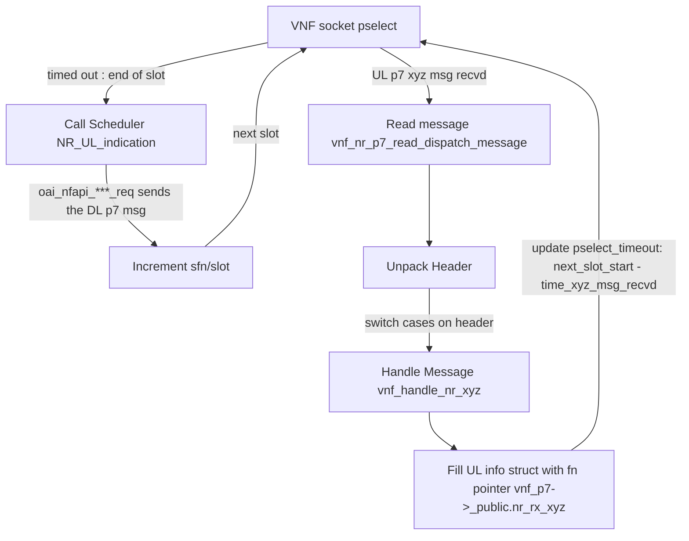
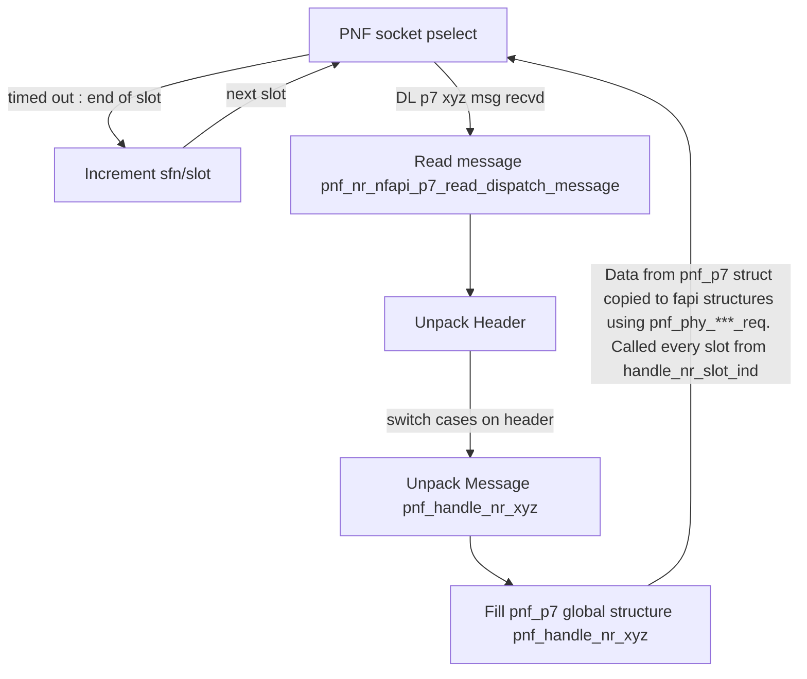

# global

xnf is pnf or vnf

The xnf starting functions are configure_nfapi_xnf()

The OAI code that read the configuration parameters call these functions that will create autonomous thread for xnf control part

These control threads create a SCTP socket by Linux API call (no use of OpenAir internal architecture with SCTP itti thread).

The main() function of softmodem has to create and start the other threads+loop on event for appropriate work: RF Rx in pnf, NGAP, GTP-U, X2, RLC, PDCP for vnf

NFAPI has it's own code directly on Linux+Posix, it doesn't reuse any piece of the OpenAir framework: SCTP thread, thread creation and management, ... 

## signaling (P5) xnf main loop

nfapi_vnf_start() create the SCTP socket, then do event waiting in a infinite loop while(vnf->terminate == 0). It accepts the pnf connections, then process the messages on reception

nfapi_pnf_start() initiate connection to vnf until it has a link. Then it enter a similar infinite loop in pnf_message_pump()

After some checks, when a message is obtained, it calls pnf_handle_p5_message() or vnf_handle_p4_p5_message() that have a switch on each p5 message types: the enum nfapi_message_id_e

Each message type has it's own processing function in the switch, like 
```
case NFAPI_START_RESPONSE:
        vnf_handle_start_response(pRecvMsg, recvMsgLen, config, p5_idx);
        break;
```

These loops are autonomous in their thread waiting incoming message.

## P7 xnf main loop

When the p5 interface receives appropriate message, it starts the p7 interface by launching a thread (see the calls to pthread_create() in nfapi/oai_integration/nfapi_xnf.c)

The p7 main loops starting is a bit simpler, thanks to UDP non connected protocol. The xnf_dispatch_p7_message() do p7 fragments re-assembly, then 
calls xnf_dispatch_p7_message() that have the big switch on message type (as in p5 above description)

So, we have the logic for UL reception in vnf, and DL reception in pnf

## P7 UL transmission by PNF

RF samples are received, and decoding is done by the PNF using control data transmitted by the VNF to the PNF through downlink p7 messages (UL_TTI_req and UL_DCI_req). 

After decoding, results are accumulated into the xNB->UL_INFO structure at the PNF. 

The data in the UL_INFO struct is transmitted through a socket in the form of 'uplink indication functions' from the PNF to the VNF. Each uplink indication message is transmitted from their respective handle functions in NR_UL_indication(). For example,

```

void handle_nr_rach(NR_UL_IND_t *UL_info) {
  if(NFAPI_MODE == NFAPI_MODE_PNF) {
    if (UL_info->rach_ind.number_of_pdus>0) {
      oai_nfapi_nr_rach_indication(&UL_info->rach_ind); //This function calls the routines required for packing + transmission through socket
      UL_info->rach_ind.number_of_pdus = 0;
    }
  }

```

## P7 UL reception at VNF

Through the infinite loop [while(vnf_p7->terminate == 0)] running in nfapi_nr_vnf_p7_start(), the VNF receives and unpacks the uplink indication message received on its socket. Based on the unpacked messages, UL_INFO struct on the VNF side gets populated. 

```

// have a p7 message
			if(FD_ISSET(vnf_p7->socket, &rfds))
			{
				vnf_nr_p7_read_dispatch_message(vnf_p7); 
			}

```

vnf_nr_dispatch_p7_message() is the function that contains the switch on various message headers so that the appropriate unpack function is called. 

## P7 DL Transmission by VNF 

DL messages are scheduled at the VNF, through NR_UL_indication(). NR_UL_indication() is called when the SFN/slot in the UL_info structure changes (this acts as a trigger for next slot processing, instead of running a separate clock at the VNF). The SFN/slot at the VNF in UL_info is updated using the slot_indication uplink p7 message, which is sent at the beginning of every slot by the PNF. The slot_indication message contains SFN/slot of the TX_thread, so that the scheduler operates slot_ahead slots ahead of the RX thread. This ensures that UL_tti_req is received before RX slot processing at the PNF. 

The function NR_schedule_response calls oai_nfapi_[DL P7 msg]_req(), which contains the routines for packing + transmission of scheduled messages through the socket to the PNF. For example, to send the 'TX_data_req' p7 message 

```

if (Sched_INFO->TX_req->Number_of_PDUs > 0)
{
  oai_nfapi_tx_data_req(Sched_INFO->TX_req);
}

```


Note that since DL P7 message reception and TX/RX processing are done on separate threads, there is the issue of the L1 processing threads trying to do their job before the required P7 message is received. In the case of RX processing, since the scheduler operates slot_ahead slots ahead of the RX thread, the required messages conveniently arrive earlier than they are required. However, in the case of TX processing, this cannot be ensured if the scheduler is exactly in sync with the TX thread.  

Therefore, we operate the VNF vnf_slot_ahead (which is currently 2) slots ahead of the PNF. This is to ensure that the DL fapi structures for a particular TX slot are all received before TX processing for that slot.

## P7 DL Reception at PNF 

Through the infinite loop [while(pnf_p7->terminate == 0)] running in pnf_nr_p7_message_pump(), the PNF receives and unpacks the downlink P7 message received on its socket. Based on the unpacked message, the appropriate message structures are filled in the PNF, and these are used further down the pipeline for processing. 

While receiving the DL P7 message, we check whether the message was received within a timing window from which it was sent. The duration of the window can be set by the user (set as a parameter for xnf in the p5 messages). Note that the DL information must be received by the PNF within a timing window at least lesser than the duration of slot_ahead variable (timing_window <= slot_ahead * slot_duration).


Once the messages are received, they are filled into slot buffers, and are stored until the processing of the slot that they were meant for. 
 


