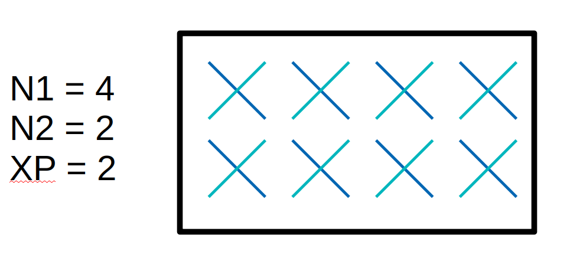

<table style="border-collapse: collapse; border: none;">
  <tr style="border-collapse: collapse; border: none;">
    <td style="border-collapse: collapse; border: none;">
      <a href="http://www.openairinterface.org/">
         
         </img>
      </a>
    </td>
    <td style="border-collapse: collapse; border: none; vertical-align: center;">
      <b><font size = "5">Running OAI Softmodems</font></b>
    </td>
  </tr>
</table>

After you have [built the softmodem executables](BUILD.md) you can set your default directory  to the build directory `cmake_targets/ran_build/build/` and start testing some use cases. Below, the description of the different oai functionalities should help you choose the oai configuration that suits your need. 

[[_TOC_]]

# Simulators

## RFsimulator

The RF simulator is an OAI device replacing the radio heads (for example the USRP device). It allows connecting the oai UE (LTE or 5G) and respectively the oai eNodeB or gNodeB through a network interface carrying the time-domain samples, getting rid of over the air unpredictable perturbations. This is the ideal tool to check signal processing algorithms and protocols implementation.  The rf simulator has some preliminary support for channel modeling.

It is planned to enhance this simulator with the following functionalities:

- Support for multiple eNodeB's or gNodeB's for hand-over tests

This is an easy use-case to setup and test, as no specific hardware is required. The [rfsimulator page](../radio/rfsimulator/README.md ) contains the detailed documentation.

## L2 nFAPI Simulator

This simulator connects a eNodeB  and UEs through a nfapi interface, short-cutting the L1 layer. The objective of this simulator is to allow multi UEs simulation, with a large number of UEs (ideally up to 255 ) .Here to ease the platform setup, UEs are simulated via a single `lte-uesoftmodem` instance. Today the CI tests just with one UE and architecture has to be reviewed to allow a number of UE above about 16. This work is on-going.

As for the rf simulator, no specific hardware is required. The [L2 nfapi simulator page](L2NFAPI.md) contains the detailed documentation.

## L1 Simulator

**This information might be outdated. We recommend to use the RFsimulator as
shown above.**

The L1 simulator is using the ethernet fronthaul protocol, as used to connect a RRU and a RAU to connect UEs and a eNodeB. UEs are simulated in a single `lte-uesoftmodem` process, as for the nfapi simulator. 

The [L1 simulator page](L1SIM.md) contains the detailed documentation.

# Running with a true radio head

OAI supports different radio heads, the following are tested in the CI:

1. [Monolithic eNodeB](https://gitlab.eurecom.fr/oai/openairinterface5g/wikis/HowToConnectCOTSUEwithOAIeNBNew) where the whole signal processing is performed in a single process
2. IF4P5 mode, where frequency domain samples are carried over ethernet, from the RRU which implement part of L1(FFT,IFFT,part of PRACH),  to a RAU
3. Monolithic gNodeB: see next section, or the [standalone tutorial](NR_SA_Tutorial_COTS_UE.md)


# 5G NR

## NSA setup with COTS UE

This setup requires an EPC, an OAI eNB and gNB, and a COTS Phone. A dedicated page describe the setup can be found [here](https://gitlab.eurecom.fr/oai/openairinterface5g/wikis/home/gNB-COTS-UE-testing).

### Launch eNB

```bash
sudo ./lte-softmodem -O ../../../targets/PROJECTS/GENERIC-LTE-EPC/CONF/enb.band7.tm1.50prb.usrpb210.conf
```

### Launch gNB

```bash
sudo ./nr-softmodem -O ../../../targets/PROJECTS/GENERIC-LTE-EPC/CONF/gnb.band78.tm1.106PRB.usrpn300.conf
```

You should see the X2 messages in Wireshark and at the eNB.

## SA setup with OAI NR-UE

The sa flag is used to run gNB in standalone mode.

In order to run gNB and UE in standalone mode, the `--sa` flag is needed.

At the gNB the `--sa` flag does the following:
- The RRC encodes SIB1 according to the configuration file and transmits it through NR-BCCH-DL-SCH.

At the UE the --sa flag will:
- Decode SIB1 and starts the 5G NR Initial Access Procedure for SA:
  1) 5G-NR RRC Connection Setup
  2) NAS Authentication and Security
  3) 5G-NR AS Security Procedure
  4) 5G-NR RRC Reconfiguration
  5) Start Downlink and Uplink Data Transfer

Command line parameters for UE in --sa mode:
- `-C` : downlink carrier frequency in Hz (default value 0)
- `--CO` : uplink frequency offset for FDD in Hz (default value 0)
- `--numerology` : numerology index (default value 1)
- `-r` : bandwidth in terms of RBs (default value 106)
- `--band` : NR band number (default value 78)
- `--ssb` : SSB start subcarrier (default value 512)

You can run this, using USRPs, on two separate machines:

```
sudo ./nr-softmodem -O ../../../targets/PROJECTS/GENERIC-NR-5GC/CONF/gnb.sa.band78.fr1.106PRB.usrpb210.conf --gNBs.[0].min_rxtxtime 6 --sa
sudo ./nr-uesoftmodem -r 106 --numerology 1 --band 78 -C 3619200000 --ssb 516 --sa
```

With the RF simulator (on the same machine):

```bash
sudo ./nr-softmodem -O ../../../targets/PROJECTS/GENERIC-NR-5GC/CONF/gnb.sa.band78.fr1.106PRB.usrpb210.conf --gNBs.[0].min_rxtxtime 6 --rfsim --sa
sudo ./nr-uesoftmodem -r 106 --numerology 1 --band 78 -C 3619200000 --ssb 516 --rfsim --sa
```

Additionally, at UE side `--uecap_file` option can be used to pass the UE Capabilities input file (path location + filename), e.g. `--uecap_file ../../../targets/PROJECTS/GENERIC-NR-5GC/CONF/uecap_ports1.xml`

## Some useful NR-UE parameters

Some other useful paramters of the UE are

 - --ue-fo-compensation: enables the frequency offset compenstation at the UE. This is useful when running over the air and/or without an external clock/time source
 - --usrp-args: this is the equivalend paramter of sdr_addrs field in the gNB config file and can be used to identify the USRP and set some basic paramters (like the clock source)
 - --clock-source: sets the clock-source (internal or external). 
 - --time-source: sets the time-source (internal or external). 


# Specific OAI modes

## phy-test setup with OAI UE

The OAI UE can also be used in front of a OAI gNB without the support of eNB or EPC. In this case both gNB and eNB need to be run with the --phy-test flag. At the gNB this flag does the following
 - it reads the RRC configuration from the configuration file
 - it encodes the RRCConfiguration and the RBconfig message and stores them in the binary files rbconfig.raw and reconfig.raw
 - the MAC uses a pre-configured allocation of PDSCH and PUSCH with randomly generated payload

At the UE the --phy-test flag will
 - read the binary files rbconfig.raw and reconfig.raw from the current directory (a different directory can be specified with the flag --rrc_config_path) and process them.


```bash
sudo ./nr-softmodem -O ../../../targets/PROJECTS/GENERIC-LTE-EPC/CONF/gnb.band78.tm1.106PRB.usrpn300.conf --phy-test
```

In phy-test mode it is possible to mimic the reception of UE Capabilities at gNB by passing through the command line parameter `--uecap_file` the location and file name of the input UE Capability file, e.g. `--uecap_file ../../../targets/PROJECTS/GENERIC-NR-5GC/CONF/uecap_ports1.xml` (1 layer) or `--uecap_file ../../../targets/PROJECTS/GENERIC-NR-5GC/CONF/uecap_ports2.xml` (2 layers).

```bash
sudo ./nr-uesoftmodem --phy-test [--rrc_config_path ../../../ci-scripts/rrc-files]
```

You need to provide `--rrc_config_path` if you don't start the UE after the gNB
in the same directory.

## noS1 setup with OAI UE

Instead of randomly generated payload, in the phy-test mode we can also inject/receive user-plane traffic over a TUN interface. This is the so-called noS1 mode. 

This setup is described in the [rfsimulator page](../radio/rfsimulator/README.md#5g-case). In theory this should also work with the real hardware target although this has yet to be tested.

## do-ra setup with OAI

The do-ra flag is used to ran the NR Random Access procedures in contention-free mode. Currently OAI implements the RACH process from Msg1 to Msg3. 

In order to run the RA, the `--do-ra` flag is needed for both the gNB and the UE.

In do-ra mode it is possible to mimic the reception of UE Capabilities at gNB by passing through the command line parameter `--uecap_file` the location and file name of the input UE Capability file, e.g. `--uecap_file ../../../targets/PROJECTS/GENERIC-NR-5GC/CONF/uecap_ports1.xml`

To run using the RFsimulator:

```bash
sudo ./nr-softmodem -O ../../../targets/PROJECTS/GENERIC-LTE-EPC/CONF/gnb.band78.tm1.106PRB.usrpn300.conf --do-ra --rfsim --parallel-config PARALLEL_SINGLE_THREAD
sudo ./nr-uesoftmodem --do-ra --rfsim --rfsimulator.serveraddr 127.0.0.1 --parallel-config PARALLEL_SINGLE_THREAD
```

Using USRPs:

```bash
sudo ./nr-softmodem -O ../../../targets/PROJECTS/GENERIC-LTE-EPC/CONF/gnb.band78.tm1.106PRB.usrpn300.conf --do-ra
```

On a separate machine:

```bash
sudo ./nr-uesoftmodem --do-ra
```


### Run OAI with SDAP & Custom DRBs

To run OAI gNB with SDAP, simply include `--gNBs.[0].enable_sdap 1` to the binary's arguments.

The DRB creation is dependent on the 5QI. 
If the 5QI corresponds to a GBR Flow it assigns a dedicated data radio bearer.
The Non-GBR flows use a shared data radio bearer.

To hardcode the DRBs for testing purposes, simply add `--gNBs.[0].drbs x` to the binary's arguements, where `x` is the number of DRBs, along with SDAP.
The hardcoded DRBs will be treated like GBR Flows. Due to code limitations at this point the max. number of DRBs is 4. 

## IF setup with OAI

OAI is also compatible with Intermediate Frequency (IF) equipment. This allows to use RF front-end that with arbitrary frequencies bands that do not comply with the standardised 3GPP NR bands. 

To configure the IF frequencies it is necessary to use two command-line options at UE side:
- `if_freq`, downlink frequency in Hz
- `if_freq_off`, uplink frequency offset in Hz

Accordingly, the following parameters must be configured in the RUs section of the gNB configuration file:
- `if_freq`
- `if_offset`

### Run OAI with custom DL/UL arbitrary frequencies

The following example uses DL frequency 2169.080 MHz and UL frequency offset -400 MHz, with a configuration file for band 66 (FDD) at gNB side.

On two separate machines with USRPs, run:

```
sudo ./nr-softmodem -O ../../../targets/PROJECTS/GENERIC-LTE-EPC/CONF/gnb.band66.tm1.106PRB.usrpx300.conf
sudo ./nr-uesoftmodem --if_freq 2169080000 --if_freq_off -400000000
```

# 5G gNB MIMO configuration

In order to enable DL-MIMO in OAI 5G softmodem, the prerequisite is to have `do_CSIRS = 1` in the configuration file. This allows the gNB to schedule CSI reference signal and to acquire from the UE CSI measurements to be able to schedule DLSCH with MIMO.

The following step is to set the number of PDSCH logical antenna ports. These needs to be larger or equal to the maximum number of MIMO layers requested (for 2-layer MIMO it is necessary to have at least two logical antenna ports).

<table style="border-collapse: collapse; border: none;">
  <tr style="border-collapse: collapse; border: none;">
    <td style="border-collapse: collapse; border: none;">
         
         </img>
    </td>
  </tr>
</table>

This image shows an example of gNB 5G MIMO logical antenna port configuration. It has to be noted that logical antenna ports might not directly correspond to physical antenna ports and each logical antenna port might consist of a sub-array of antennas.

In 5G the basic element is a dual-polarized antenna, therefore the minimal DL MIMO setup with two logical antenna ports would consist of two cross-polarized antenna elements. In a single panel configuration, as the one in the picture, this element can be repeated vertically and/or horizontally to form an equi-spaced 1D or 2D array. The values N1 and N2 represent the number of antenna ports in the two dimensions and the supported configurations are specified in Section 5.2.2.2.1 of TS 38.214.

The DL logical antenna port configuration can be selected through configuration file. `pdsch_AntennaPorts_N1` can be used to set N1 parameter, `pdsch_AntennaPorts_N2` to set N2 and `pdsch_AntennaPorts_XP` to set the cross-polarization configuration (1 for single pol, 2 for cross-pol). To be noted that if XP is 1 but N1 and/or N2 are larger than 1, this would result in a non-standard configuration and the PMI selected would be the identity matrix regardless of CSI report. The default value for each of these parameters is 1. The total number of PDSCH logical antenna ports is the multiplication of those 3 parameters.

Finally the number of TX physical antenna in the RU part of the configuration file, `nb_tx`, should be equal or larger than the total number of PDSCH logical antenna ports.

[Example of configuration file with parameters for 2-layer MIMO](https://gitlab.eurecom.fr/oai/openairinterface5g/-/blob/develop/targets/PROJECTS/GENERIC-NR-5GC/CONF/gnb.sa.band77.fr1.273PRB.2x2.usrpn300.conf)

# Additional links

[Selecting an alternative ldpc implementation at run time](../openair1/PHY/CODING/DOC/LDPCImplementation.md)
