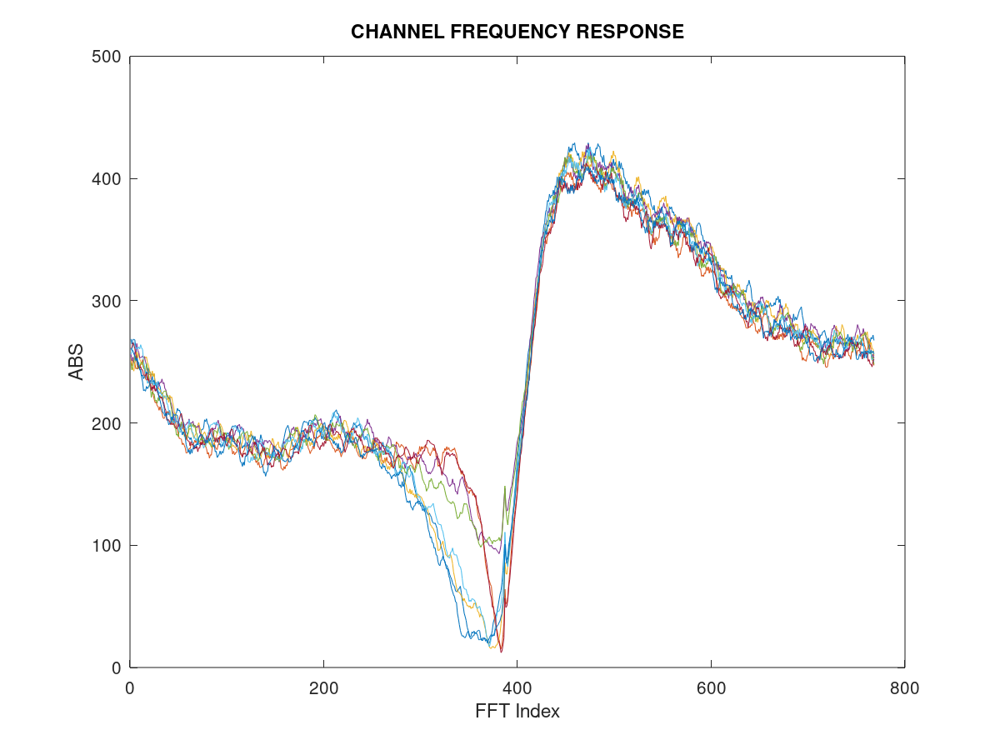
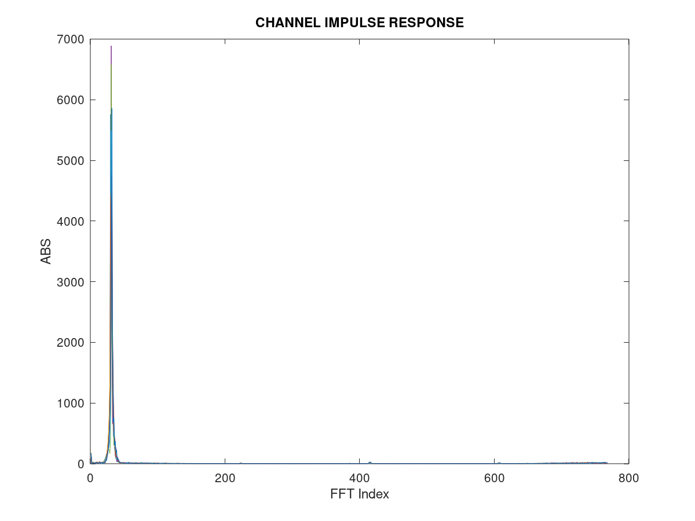

<table style="border-collapse: collapse; border: none;">
  <tr style="border-collapse: collapse; border: none;">
    <td style="border-collapse: collapse; border: none;">
      <a href="http://www.openairinterface.org/">
         
         </img>
      </a>
    </td>
    <td style="border-collapse: collapse; border: none; vertical-align: center;">
      <b><font size = "8">Running NR PRS with OAI gNB and nrUE</font></b>
    </td>
  </tr>
</table>

This page is valid on tags starting from **`2022.w37`**.


After you have [built the softmodem executables](BUILD.md), go to the build directory `openairinterface5g/cmake_targets/ran_build/build/` and start testing the Rel16 PRS usecases.

# PRS parameters and config files

| **Mode** 	                    | **gNB config**                                                                          	  | **nrUE config**           	|
|-----------------------------	|-------------------------------------------------------------------------------------------  |---------------------------	|
| **FR1 40MHz<br>30kHz SCS**  	| gnb0.sa.band78.fr1.106PRB.prs.usrpx310.conf<br>gnb1.sa.band78.fr1.106PRB.prs.usrpx310.conf 	| ue.nr.prs.fr1.106prb.conf 	|
| **FR2 100MHz<br>120kHz SCS**  | gnb0.sa.band261.fr2.64PRB.prs.usrpx310.conf<br>gnb1.sa.band261.fr2.64PRB.prs.usrpx310.conf 	| ue.nr.prs.fr2.64prb.conf  	|

Under gNB and nrUE config files, parameters are configured under `prs_config` section. nrUE is capable to receive downlink PRS signal from multiple gNB simultaneously and therefore nrUE config file contains multiple `prs_config` sections, corresponding to each gNB. These parameters can be changed as per the test scenario.

As of now, PRS **Comb size of 2 and 4** is supported and validated with R&S Spectrum analyzer. Also Muting is NOT supported yet. Sample configuration as below:

```
prs_config = (
{
  NumPRSResources       = 1;
  PRSResourceSetPeriod  = [20, 2];
  SymbolStart           = [7];
  NumPRSSymbols         = [6];
  NumRB                 = 106;
  RBOffset              = 0;
  CombSize              = 4;
  REOffset              = [0];
  PRSResourceOffset     = [0];
  PRSResourceRepetition = 1;
  PRSResourceTimeGap    = 1;
  NPRS_ID               = [0];
  MutingPattern1        = [];
  MutingPattern2        = [];
  MutingBitRepetition   = 1;
}
);
```
To TURN OFF PRS, set `NumPRSResources=0` in gNB `prs_config` section. nrUE config has `Active_gNBs` to specify number of active gNBs transmitting PRS signal simultaneously. Find the help string for PRS parameters in `openair2/COMMON/prs_nr_paramdef.h` <br><br>

# gNB in `phy-test` mode
Note that `numactl` is only needed if you run on a NUMA architecture with more than 1 CPU. In this case it should be installed on Linux using command `sudo apt-get install -y numactl`

Also check the numa nodes USRP’s are connected to, using the following command:

```cat /sys/class/net/eth_if/device/numa_node```

Where `eth_if` has to be replaced with the name of the network interface the USRP is connected to. 
In our case the output is 0 and hence we use `numactl --cpunodebind=0 --membind=0`

## FR1 test
Open a terminal on the host machine, and execute below command to launch gNB with **X310 USRPs**

```sudo numactl --cpunodebind=0 --membind=0 ./nr-softmodem -E -O ../../../targets/PROJECTS/GENERIC-NR-5GC/CONF/gnb0.sa.band78.fr1.106PRB.prs.usrpx310.conf --phy-test```

If **N310 USRPs** are used, then run above command `without -E option` i.e without 3/4 sampling rate.<br><br>


To run using **rfsimulator**, execute following command:  

```sudo ./nr-softmodem -O ../../../targets/PROJECTS/GENERIC-NR-5GC/CONF/gnb0.sa.band78.fr1.106PRB.prs.usrpx310.conf --parallel-config PARALLEL_SINGLE_THREAD --noS1 --rfsim --phy-test```

## FR2 test
In FR2 mode, we need RF beamforming module to transmit signal in mmWave frequency range. **X310 USRPs** can be used with BasicTx daughtercard to transmit baseband signal at **Intermediate Frequncy(IF)** and then RF beamforming module would perform beamforming and the upconversion to FR2 frequencies. IF can be specified using `if_freq` in the RU section of gNB config.

If RF beamforming module is NOT present, gNB can still be launched with USRP alone; to transmit at supported `if_freq`.

```sudo numactl --cpunodebind=0 --membind=0 ./nr-softmodem -E -O ../../../targets/PROJECTS/GENERIC-NR-5GC/CONF/gnb0.sa.band261.fr2.64PRB.prs.usrpx310.conf --phy-test```<br><br>


To run using **rfsimulator**, execute following command:  

```sudo ./nr-softmodem -O ../../../targets/PROJECTS/GENERIC-NR-5GC/CONF/gnb0.sa.band261.fr2.64PRB.prs.usrpx310.conf --parallel-config PARALLEL_SINGLE_THREAD --noS1 --rfsim --phy-test```

## Multiple gNB scenario
PRS is primarily used for positioning and localization of the UE with multiple gNBs transmitting simultaneously. OAI PRS implementation supports multiple gNB transmission provided all the gNBs are tightely synchronized using GPSDO clock. Therefore before running this scenario, make sure the USRPs has built-in GPSDO and the GPS antennas are connected with good satellite visibility. Also every time a gNB is launched, wait until `GPS LOCKED` is printed on the terminal during gNB startup. If USRP fails to lock with GPSDO, try again until its locked.

To use GPSDO, make sure to change `clock_source` and `time_source` to `gpsdo` in RU section of gNB config.

```sudo numactl --cpunodebind=0 --membind=0 ./nr-softmodem -E -O ../../../targets/PROJECTS/GENERIC-NR-5GC/CONF/gnb0.band78.fr1.106PRB.prs.usrpx310.conf --phy-test```

```sudo numactl --cpunodebind=1 --membind=1 ./nr-softmodem -E -O ../../../targets/PROJECTS/GENERIC-NR-5GC/CONF/gnb1.band78.fr1.106PRB.prs.usrpx310.conf --phy-test```<br><br>


# nrUE in `phy-test` mode
While running gNB and nrUE on the same host machine, `reconfig.raw` and `rbconfig.raw` files would be generated with the launch of gNB and and then nrUE would automatically source it from build directory. However, if gNB and nrUE are running on two different host machines, then run gNB first with the corresponding config and exit after few seconds. This would generate `reconfig.raw` and `rbconfig.raw` files.

After this, nrUE can be launched using one of the below commands depending on the test scenario. If UE is NOT able to connect to the gNB, then check the USRP connections or try increasing `--ue-rxgain` in steps of 10dB.  

Also check the instructions on `numactl` in gNB test section as it applies for nrUE execution as well.

## FR1 test
Once gNB is up and running, open another terminal and execute below command to launch nrUE with **X310 USRPs**. Make sure to specify `IP_ADDR1` and `IP_ADDR2`(optional) correctly as per USRPs IP address

```sudo numactl --cpunodebind=0 --membind=0 ./nr-uesoftmodem -E --phy-test --usrp-args "addr=IP_ADDR1,second_addr=IP_ADDR2,time_source=internal,clock_source=internal" -O ../../../targets/PROJECTS/GENERIC-NR-5GC/CONF/ue.nr.prs.fr1.106prb.conf --ue-rxgain 80 --ue-fo-compensation --non-stop```  

If **N310 USRPs** are used, then run above command `without -E option` i.e without 3/4 sampling rate.<br><br>


To run using **rfsimulator** with local ETH IF `127.0.0.1`, execute following command:  

```
sudo ./nr-uesoftmodem --rfsim --phy-test --noS1 -O ../../../targets/PROJECTS/GENERIC-NR-5GC/CONF/ue.nr.prs.fr1.106prb.conf --rfsimulator.serveraddr 127.0.0.1
```

## FR2 test
Like gNB, RF beamforming module is receiving at mmWave frequencies and then **X310 USRPs** with BasicRx daughtercard to receive the signal at intermediate frequncy(IF) from RF beamforming module. IF can be specified using `--if_freq` option in nrUE command line.

If RF beamforming module is NOT present, nrUE can still be launched with USRP alone; to receive at `if_freq` and validation can be done. Make sure to specify `if_freq` in the range supported by USRP nrUE is running with.

```sudo numactl --cpunodebind=0 --membind=0 ./nr-uesoftmodem -E --phy-test -O ../../../targets/PROJECTS/GENERIC-NR-5GC/CONF/ue.nr.prs.fr2.64prb.conf --usrp-args "addr=IP_ADDR1,second_addr=IP_ADDR2,time_source=internal,clock_source=internal" --ue-rxgain 80 --ue-fo-compensation --if_freq 50000000 --non-stop```<br><br>


To run using **rfsimulator** with local ETH IF `127.0.0.1`, execute following command:  

```
sudo ./nr-uesoftmodem --rfsim --phy-test --noS1 -O ../../../targets/PROJECTS/GENERIC-NR-5GC/CONF/ue.nr.prs.fr2.64prb.conf --rfsimulator.serveraddr 127.0.0.1
```

## Multiple gNB scenario
In nrUE prs config file, change `Active_gNBs` to the actual number of gNBs launched. Also verify the parameter in `prs_config` sections of nrUE config is matching with that of gNB config used. And launch nrUE using one of the above commands depending on FR1/FR2 test scenario.

After successful connection, UE starts estimating channel based on the downlink PRS pilots using Least-Squares(LS) method. In the frequency domain, linear interpolation is used to reconstruct the channel over entire PRS bandwidth using LS estimates at pilot locations. UE also measures Time of Arrival(ToA) based on the time domain impulse response. On the console, ToA measurement is printed for each PRS resource.

```
[PHY]   [gNB 0][rsc 0][Rx 0][sfn 314][slot 2] DL PRS ToA ==> 1 / 1024 samples, peak channel power 15.6 dBm, SNR +4 dB
[PHY]   [gNB 0][rsc 1][Rx 0][sfn 314][slot 12] DL PRS ToA ==> 1 / 1024 samples, peak channel power 15.6 dBm, SNR +4 dB
[PHY]   [gNB 0][rsc 2][Rx 0][sfn 314][slot 22] DL PRS ToA ==> 1 / 1024 samples, peak channel power 15.6 dBm, SNR +4 dB
[PHY]   [gNB 0][rsc 3][Rx 0][sfn 314][slot 32] DL PRS ToA ==> 1 / 1024 samples, peak channel power 15.6 dBm, SNR +4 dB
```

At UE side, T tracer is used to dump PRS channel estimates, both in time and frequency domain using `UE_PHY_DL_CHANNEL_ESTIMATE` and `UE_PHY_DL_CHANNEL_ESTIMATE_FREQ` respectively. These dumps can be enabled using options `--T_stdout 0` without console prints or `--T_stdout 2` with console prints; in above nrUE launch command.<br><br>

# Recording T tracer dumps
Once nrUE is launched with `--T_stdout 0 or 2` option, open another terminal. Navigate to T tracer directory ```common/utils/T/tracer/``` and build the T tracer binary using ```make```

Once the build is successful, execute following command to start recording the PRS channel estimates dumps

```./record -d ../T_messages.txt -on LEGACY_PHY_INFO -on UE_PHY_DL_CHANNEL_ESTIMATE -on UE_PHY_DL_CHANNEL_ESTIMATE_FREQ -o prs_dumps.raw```  

Exit using `Ctrl+C` to stop recording, else it will keep running and take lot of disk space. Generally running it for 1-2 minutes should collect sufficient dumps.<br><br>


To check the contents of recorded .raw file, replay it by executing:

```./replay -i prs_dumps.raw```

and textlog it on another terminal with following command:

```./textlog -d ../T_messages.txt -ON -no-gui```<br><br>

# Extracting PRS channel estimates
Once T tracer dumps are recorded, PRS channel estimates can be extracted from .raw file using bash script `extract_prs_dumps.sh` in T tracer directory ```common/utils/T/tracer/```

```./extract_prs_dumps.sh -g <num_gnb> -n <num_resources> -f <recorded .raw file> -c <count>```

In the end, the script will zip all the extracted dumps to `prs_dumps.tgz`. Make sure to check help in running script using -h option: 
```./extract_prs_dumps.sh -h```<br><br>

# Using Matlab/Octave script to visualize PRS channel estimates
We have developed `plot_prs_Ttracer_dumps.m` script to visualize the extracted PRS dumps offline in Matlab/Octave. Location of the script is `openair1/PHY/NR_UE_ESTIMATION/plot_prs_Ttracer_dumps.m`

Make sure to enter the parameters script asks as input like below:

```
Enter the directory path to T tracer dumps: '<workspace>/openairinterface5g/common/utils/T/tracer'  
Enter the OFDM FFT size used for file parsing: <frame_parms->ofdm_symbol_size>  
Enter number of PRS respurces: <NumPRSResources>  
Enter number of active gNBs: <Active_gNBs>
```
This script will read the IQ data from extracted PRS dumps(chF_gnbX_Y.raw and chT_gnbX_Y.raw) and plot them like below
<table style="border-collapse: collapse; border: none;">
  <tr style="border-collapse: collapse; border: none;">
    <td style="border-collapse: collapse; border: none;">
         
         
         </img>
         <figcaption align = "center"><b>Fig.1 - FR2 100MHz test</b></figcaption>
    </td>
  </tr>
</table>
