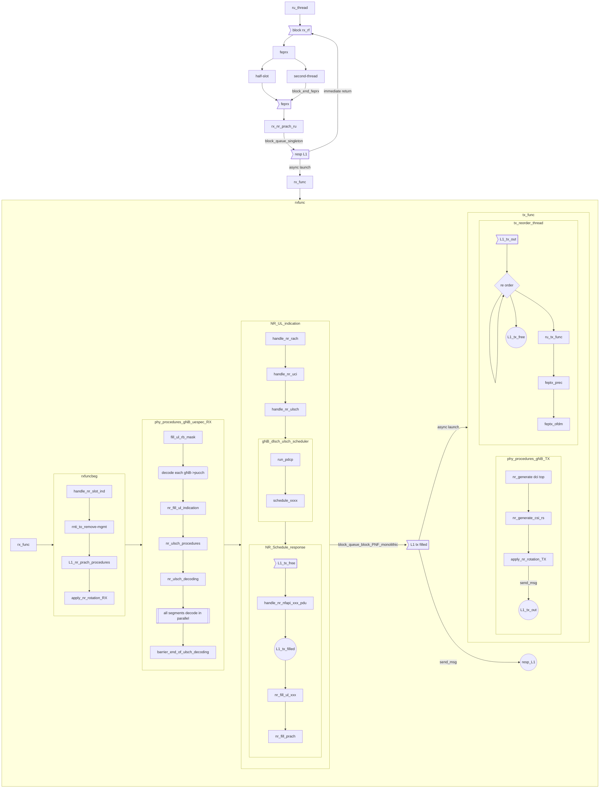

```mermaid
flowchart TB
    A[ru_thread] --> RFin>block rx_rf] --> feprx
    feprx --> half-slot --> end_feprx
    feprx --> second-thread -- block_end_feprx --> end_feprx>feprx]
    end_feprx --> rx_nr_prach_ru
rx_nr_prach_ru -- block_queue_singleton --> resp_L1>resp L1]
resp_L1 -- async launch --> rx_func
resp_L1 -- immediate return --> RFin

subgraph rxfunc
rx_func_implem[rx_func] 
    subgraph rxfuncbeg
      handle_nr_slot_ind
      --> rnti_to_remove-mgmt
      --> L1_nr_prach_procedures
      --> apply_nr_rotation_RX
    end 
    subgraph phy_procedures_gNB_uespec_RX
      fill_ul_rb_mask
      --> pucch(decode each gNB->pucch)
      -->nr_fill_ul_indication
      --> nr_ulsch_procedures
      --> nr_ulsch_decoding
      --> segInParallel[[all segments decode in parallel]]
      --> barrier_end_of_ulsch_decoding
    end 
    subgraph NR_UL_indication
      handle_nr_rach
      --> handle_nr_uci
      --> handle_nr_ulsch
      subgraph gNB_dlsch_ulsch_scheduler
          run_pdcp
          --> schedule_xxxx
      end
      handle_nr_ulsch --> gNB_dlsch_ulsch_scheduler
      subgraph NR_Schedule_response
         L1_tx_free3>L1_tx_free]
         --> handle_nr_nfapi_xxx_pdu
         --> sendTxFilled((L1_tx_filled))
         --> nr_fill_ul_xxx
         --> nr_fill_prach
      end
      gNB_dlsch_ulsch_scheduler --> NR_Schedule_response
    end 
    rx_func_implem --> rxfuncbeg
    rxfuncbeg --> phy_procedures_gNB_uespec_RX
phy_procedures_gNB_uespec_RX --> NR_UL_indication
-- block_queue_block_PNF_monolithic --> L1_tx_free2>L1 tx filled]
-- async launch --> tx_func
L1_tx_free2 -- send_msg --> rsp((resp_L1))
end 
rx_func --> rxfunc


subgraph tx_func
    direction LR
    subgraph phy_procedures_gNB_TX
       dcitop[nr_generate dci top]
       --> nr_generate_csi_rs
       --> apply_nr_rotation_TX
       -- send_msg --> end_tx_func((L1_tx_out))
    end
    subgraph tx_reorder_thread
        L1_tx_out>L1_tx_out]
        --> reorder{re order} --> reorder
        reorder --> ru_tx_func
        reorder --> L1_tx_free((L1_tx_free))
        ru_tx_func --> feptx_prec
        --> feptx_ofdm
    end 
end

```
