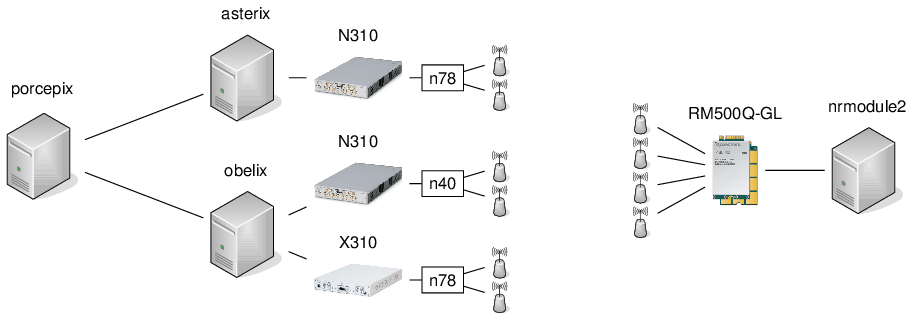
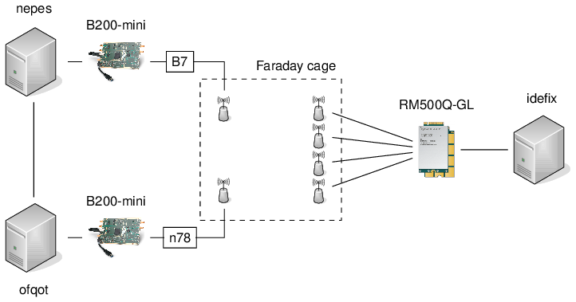
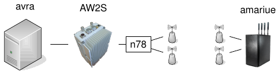
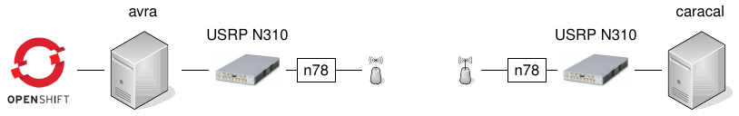
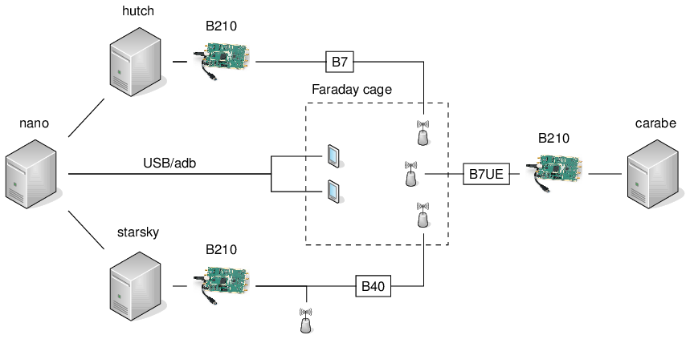

**Table of Contents**

[[_TOC_]]

## Machines

| Machine       | IP address      | Lockable Resource     | Function           | Connected devices                                     |
| ------------- | --------------- | --------------------- | ------------------ | ----------------------------------------------------- |
| asterix       | 172.21.16.127   | CI-Asterix-Usage      | gNB (n78)          | 172.21.19.14                                          |
| obelix        | 172.21.16.128   | CI-Obelix-Usage       | eNB (n40, n78), nrUE | 172.21.19.13, X300 (192.168.60.2)                   |
| porcepix      | 172.21.16.136   | CI-Porcepix           | Executor, EPC, 5GC | --                                                    |
| nrmodule2     | 172.21.16.139   | CI-NrModule2          | Quectel            | Quectel module                                        |
| nepes         | 172.21.16.137   | CI-Nepes              | gNB (n78), EPC/5GC | B200mini (30C51EB)                                    |
| ofqot         | 172.21.16.109   | CI-Ofqot              | gNB (n78)          | B200mini (30C51D4)                                    |
| idefix        | 172.21.16.135   | CI-Idefix             | Quectel            | Quectel module                                        |
| caracal       | 172.21.16.132   | CI-Caracal            | gNB/phytest        | N300 (192.168.10.2)                                   |
| amariue       | 172.21.16.144   | CI-Amarisoft-UE-Usage | nrUE               | Amarisoft UE simulator                                |
| manarola      | 172.21.8.116    | _None_                | gNB                | AW2S                                                  |
| nano          | 172.21.18.48    | CI-Nano-Legacy-EPC    | Executor, EPC, adb | 2x COTS (adb)                                         |
| hutch         | 172.21.18.46    | CI-Hutch-Legacy-FDD-eNB | eNB (B7)           | B200mini (30C5239)                                  |
| starsky       | 172.21.18.45    | CI-Starsky-Legacy-TDD-eNB       | eNB (B40)  | b200mini (30A3E3C)                                  |
| carabe        | 172.21.18.47    | CI-Carabe-Legacy-FDD-OAI-LTE-UE | UE (B7UE)  | B200mini (30AE8C9)                                  |
| nokiabox      | 172.21.19.39    | _None_                | gNB (Nokia), 5GC   | _Nokia RF integrated_                                 |
| avra          | 172.21.16.124   | CI-Avra-Usage         | gNB (n78)          | AW2S Jaguar (192.168.80.239)                          |

Note: The available resources, and their current usage, is indicated here:
- [Lockable resources of jenkins-oai](https://jenkins-oai.eurecom.fr/lockable-resources/):
  "New" Jenkins, i.e., with RAN-Container-Parent

## Networked devices

| Type          | IP address (mgmt) |
| ------------- | ----------------- |
| USRP N310     | 172.21.19.14      |
| USRP N310     | 172.21.19.13      |

## Testbenches

### 5G OTA Testbench

**Purpose**: Over-the-air 4G/5G (NSA/SA) tests, performance tests

[PDF version](testbenches_doc_resources/5g-ota-bench.pdf) | [LaTeX/TikZ version](testbenches_doc_resources/5g-ota-bench.tex) if you want to modify to reflect your setup

### 5G NSA/Faraday Cage Testbench

**Purpose**: Faraday cage 5G tests, functional tests

[PDF version](testbenches_doc_resources/5g-nsa-faraday-bench.pdf) | [LaTeX/TikZ version](testbenches_doc_resources/5g-nsa-faraday-bench.tex) if you want to modify to reflect your setup

### 5G AW2S Testbench

**Purpose**: AW2S tests with Amarisoft UE simulator

[PDF version](testbenches_doc_resources/5g-aw2s-bench.pdf) | [LaTeX/TikZ version](testbenches_doc_resources/5g-aw2s-bench.tex) if you want to modify to reflect your setup

### 5G UE OTA Testbench

**Purpose**: Over-the-air 5G tests with OAI UE

[PDF version](testbenches_doc_resources/5g-nrue-bench.pdf) | [LaTeX/TikZ version](testbenches_doc_resources/5g-nrue-bench.tex) if you want to modify to reflect your setup

### 4G Testbench(es)

**Purpose**: 4G/LTE testbenches

[PDF version](testbenches_doc_resources/4g-faraday-bench.pdf) | [LaTeX/TikZ version](testbenches_doc_resources/4g-faraday-bench.tex) if you want to modify to reflect your setup

## Pipelines

### [RAN-Container-Parent](https://jenkins-oai.eurecom.fr/job/RAN-Container-Parent/)

**Purpose**: automatically triggered tests on MR creation or push, from Gitlab
Webhook

- [RAN-cppcheck](https://jenkins-oai.eurecom.fr/job/RAN-cppcheck/1664/)
  - obelix
  - performs static code analysis, currently not actively enforced
- [RAN-gNB-N300-Timing-Phytest-LDPC](https://jenkins-oai.eurecom.fr/view/RAN/job/RAN-gNB-N300-Timing-Phytest-LDPC/)
  - caracal + N310
  - pure performance test through phy-test scheduler, see command line for more details
- [RAN-Interop-F1](https://jenkins-oai.eurecom.fr/job/RAN-Interop-F1/)
  - ofqot (DU, 1x UE)
  - F1 interoperability testing: sets up connection to Accelleran CU, UE connection and connectivity test
- [RAN-L2-Sim-Test-4G](https://jenkins-oai.eurecom.fr/job/RAN-L2-Sim-Test-4G/)
  - obelix (eNB, 1x UE, OAI EPC)
  - L2simulator: skips physical layer and uses proxy between eNB and UE
- [RAN-L2-Sim-Test-5G](https://jenkins-oai.eurecom.fr/job/RAN-L2-Sim-Test-5G/)
  - obelix (gNB, 1x UE, OAI 5GC)
  - L2simulator: skips physical layer and uses proxy between gNB and UE, currently only ping
- [RAN-LTE-FDD-LTEBOX-Container](https://jenkins-oai.eurecom.fr/job/RAN-LTE-FDD-LTEBOX-Container/)
  - hutch + B210, nano w/ ltebox + 2x UE
  - tests RRC inactivity timers, different bandwidths
- [RAN-LTE-TDD-2x2-Container](https://jenkins-oai.eurecom.fr/view/RAN/job/RAN-LTE-TDD-2x2-Container/)
  - obelix + N310, porcepix, nrmodule2 + Quectel
  - TM1 and TM2 test
- [RAN-LTE-TDD-LTEBOX-Container](https://jenkins-oai.eurecom.fr/job/RAN-LTE-TDD-LTEBOX-Container/)
  - starsky + B210, nano w/ ltebox + 2x UE
  - TM1 over bandwidths 5, 10, 20 MHz in Band 40, default scheduler for 20 MHz
- [RAN-NSA-B200-Module-LTEBOX-Container](https://jenkins-oai.eurecom.fr/job/RAN-NSA-B200-Module-LTEBOX-Container/)
  - nepes + B200 (eNB), ofqot + B200 (gNB), idefix + Quectel, nepes w/ ltebox
  - basic NSA test
- [RAN-PhySim-Cluster](https://jenkins-oai.eurecom.fr/job/RAN-PhySim-Cluster/)
  - cluster (`Asterix-OC-oaicicd-session` resource), tests in OpenShift Cluster
  - unitary simulators (`nr_dlsim`, etc.)
- [RAN-RF-Sim-Test-4G](https://jenkins-oai.eurecom.fr/job/RAN-RF-Sim-Test-4G/)
  - obelix (eNB, lteUE, OAI EPC)
  - uses RFsimulator, for FDD 5, 10, 20MHz with core, 5MHz noS1
- [RAN-RF-Sim-Test-5G](https://jenkins-oai.eurecom.fr/job/RAN-RF-Sim-Test-5G/)
  - obelix (gNB, nrUE, OAI 5GC)
  - uses RFsimulator, TDD 40MHz, FDD 40MHz, F1 split
- [RAN-RHEL8-Cluster-Image-Builder](https://jenkins-oai.eurecom.fr/job/RAN-RHEL8-Cluster-Image-Builder/)
  - cluster (`Asterix-OC-oaicicd-session` resource): RHEL 8 image build using the OpenShift Cluster
- [RAN-SA-AW2S-CN5G](https://jenkins-oai.eurecom.fr/job/RAN-SA-AW2S-CN5G/)
  - 5G-NR SA test setup: avra(RHEL9.1) + AW2S, amariue, OAI CN5G
  - uses OpenShift cluster for CN deployment and container images for gNB deployment
  - multi UE testing
- [RAN-SA-B200-Module-SABOX-Container](https://jenkins-oai.eurecom.fr/job/RAN-SA-B200-Module-SABOX-Container/)
  - ofqot + B200, idefix + Quectel, nepes w/ sabox
  - basic SA test (20 MHz TDD), F1, reestablishment, ...
- [RAN-SA-OAIUE-CN5G](https://jenkins-oai.eurecom.fr/job/RAN-SA-OAIUE-CN5G/)
  - 5G-NR SA test setup: gNB on avra(RHEL9.2) + N310, OAIUE on caracal(RHEL9.1) + N310, OAI CN5G
  - OpenShift cluster for CN deployment and container images for gNB and UE deployment
- [RAN-Ubuntu18-Image-Builder](https://jenkins-oai.eurecom.fr/job/RAN-Ubuntu18-Image-Builder/)
  - obelix: Ubuntu 20 image build using docker (Note: builds U20 images while pipeline is named U18!)

### RAN-CI-NSA-Trigger

***DEFUNCT***: longer-running over-the-air LTE, NSA, and SA tests. To be integrated into RAN-Container-Parent.

- [RAN-NSA-2x2-Module-OAIEPC](https://jenkins-oai.eurecom.fr/job/RAN-NSA-2x2-Module-OAIEPC/)
  - obelix + N310 (eNB), asterix + N310 (gNB), nrmodule2 + Quectel, porcepix w/ Magma EPC
  - LTE 2x2 and NR 2x2 (non-standalone)
- [RAN-SA-Module-CN5G](https://jenkins-oai.eurecom.fr/view/RAN/job/RAN-SA-Module-CN5G/)
  - asterix + N310 (gNB), nrmodule2 + Quectel, porcepix w/ OAI 5GC
  - NR 2x2 (standalone)
- [RAN-SA-AmariS-CN5G](https://jenkins-oai.eurecom.fr/view/RAN/job/RAN-SA-AmariS-CN5G/)
  - asterix + N310, amariue (1x UE), porcepix w/ OAI 5GC
  - Amarisoft UE simulator: expected to be increased to more UEs

### RAN-CI-develop

***DEFUNCT***: automatically triggered tests, mostly 4G, to be phased out and
integrated into RAN-Container-Parent

The following defunct pipelines remain to be integrated into RAN-Container-Parent:
- eNB-CI-IF4p5-FDD-Band7-B210
  - hutch + B210, nano w/ ltebox + 2x UE
  - tests IF4.5 split over bandwidths 5, 10, 20 MHz in Band 7
- eNB-CI-IF4p5-TDD-Band40-B210
  - starsky + B210, nano w/ ltebox + 2x UE
  - tests IF4.5 split over bandwidths 5, 10, 20 MHz in Band 40
- eNB-UE-CI-MONO-FDD-Band7-B200
  - hutch + B210 (eNB), carabe + B210 (4G UE), nano w/ ltebox
  - tests OAI 4G for 5 MHz/TM1 with both CN and in noS1 model, MBMS; known to
    be unstable
- UE-CI-FDD-Band20-B200
  - starsky + B210 (sniffer)
  - Sniff MIB + SIB1 of Orange, SFR
