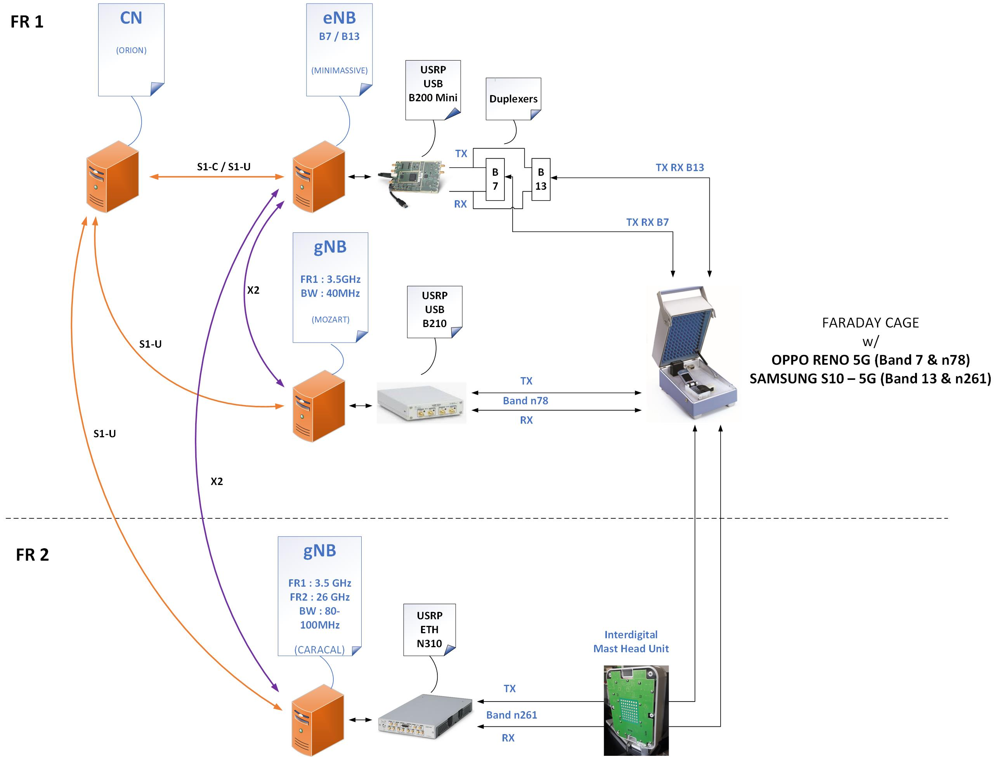
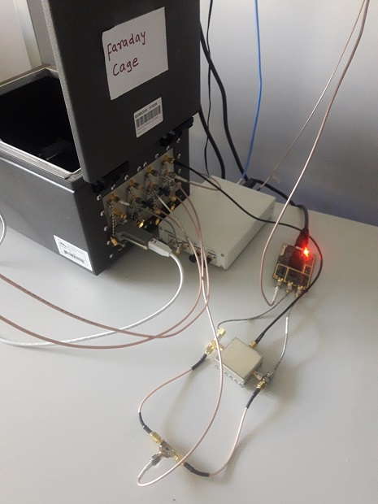
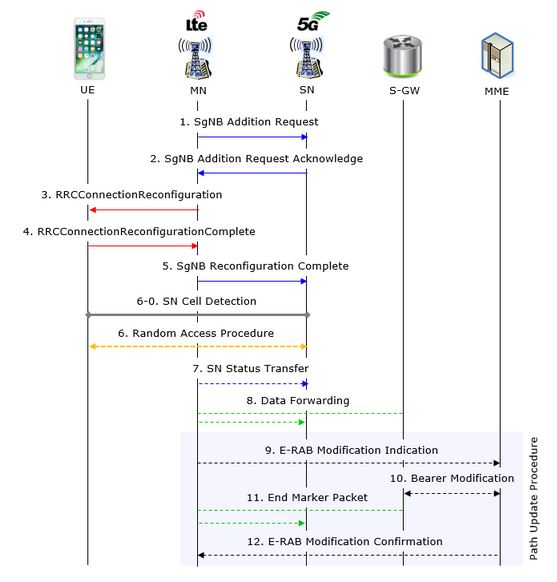

STATUS 2020/10/15 : added External Resources section and links  

**Table of Contents**

[[_TOC_]]

## External Resources

Additional Resources to this page can be found here (special mention to Walter Maguire <wmaguire@live.com>) :  
https://docs.google.com/document/d/1pL8Szm0ocGxdl5ESVp12Ff71a4PbhCb9SpvbLZzwYbo/edit?usp=sharing  
At time of writing, the openairinterface5G Commit Tag is 2020.w39


Faraday Cages can be found here :  
http://www.saelig.com/MFR00066/ste2300.htm


## Configuration Overview

* Non Standalone (NSA) configuration  : initial Control Plane established between UE and RAN eNB, then User Plane established between UE and gNB, Core network is 4G based supporting rel 15
* OAI Software Defined gNB and eNB
* eNB RF front end: USRP (ETTUS) B200 Mini or B210
* gNB RF front end: USRP (ETTUS) B200 Mini or B210 (N310 will be needed for MIMO and wider BW's)
* 5G TDD duplexing mode
* 5G FR1 Band n78 (3.5 GHz)
* BW: 40MHz
* Antenna scheme: SISO

## COTS UEs 

Our code might not work with all 5G phones yet, but we are constantly improving it. Here is a list of COTS UEs that we know that work with OAI. 

*  Oppo Reno 5G
*  Samsung A90 5G
*  Samsung A42 5G
*  Google Pixel 5G (note1)
*  Simcom SIMCOM8200EA 
*  Quectel RM500Q-GL

Note1: In the version we have at Eurecom, you need to set the PLMN to 50501, and you also need to change the firmware to "11.0.0 (RD1A.201105.003.B1, Nov 2020, EU carriers)" (see https://developers.google.com/android/images)

## Repository

https://gitlab.eurecom.fr/oai/openairinterface5g/tree/develop

## Architecture Setup

The scheme below depicts our typical setup:



The photo depicts the FR1 setup part of the scheme above:  




## Build and Install

General guidelines to build eNB and gNB :
See https://gitlab.eurecom.fr/oai/openairinterface5g/blob/develop/doc/BUILD.md#building-ues-enodeb-and-gnodeb-executables


- **eNB**

```
cd <your oai installation directory>/openairinterface5g/
source oaienv
cd cmake_targets/
./build_oai -I -w USRP --eNB

```

- **gNB**

```
cd <your oai installation directory>/openairinterface5g/
source oaienv
cd cmake_targets/
./build_oai -I -w USRP --gNB
```


- **EPC**

for reference:
https://github.com/OPENAIRINTERFACE/openair-epc-fed/blob/master/docs/DEPLOY_HOME.md


## Configuration Files

Each component (EPC, eNB, gNB) has its own configuration file.  
These config files are passed as arguments of the run command line, using the option -O \<conf file\>

The **REFERENCE** files for eNB and gNB, **used by the CI**, can be found here:  
[enb conf file](../ci-scripts/conf_files/enb.band7.tm1.fr1.25PRB.usrpb210.conf)
[gnb conf file](../ci-scripts/conf_files/gnb.band78.tm1.fr1.106PRB.usrpb210.conf)

These files have to be updated manually to set the IP addresses and frequency.  


**ATTENTION** : an **EXTERNAL** clock is used to sync the eNB and gNB,  
whether the clock is internal or external is defined in the configuration files (!! details needed !!)   


1- In the **eNB configuration file** :
- look for MME IP address, and update the **ipv4 field** with the IP address of the **EPC** server
```
    ////////// MME parameters:
    mme_ip_address      = ( { ipv4       = "**YOUR_EPC_IP_ADDR**";
                              ipv6       = "192:168:30::17";
                              active     = "yes";
                              preference = "ipv4";
                            }
                          );

```

- look for S1 IP address, and update the **3 fields below** with the IP address of the **eNB** server  
```
    NETWORK_INTERFACES :
    {
        ENB_INTERFACE_NAME_FOR_S1_MME            = "eth0";
        ENB_IPV4_ADDRESS_FOR_S1_MME              = "**YOUR_ENB_IP_ADDR**";
        ENB_INTERFACE_NAME_FOR_S1U               = "eth0";
        ENB_IPV4_ADDRESS_FOR_S1U                 = "**YOUR_ENB_IP_ADDR**";
        ENB_PORT_FOR_S1U                         = 2152; # Spec 2152
        ENB_IPV4_ADDRESS_FOR_X2C                 = "**YOUR_ENB_IP_ADDR**";
        ENB_PORT_FOR_X2C                         = 36422; # Spec 36422
    };

```

2- In the **gNB configuration file** :
- look for MME IP address, and update the **ipv4 field** with the IP address of the **EPC** server
```
    ////////// MME parameters:
    mme_ip_address      = ( { ipv4       = "**YOUR_EPC_IP_ADDR**";
                              ipv6       = "192:168:30::17";
                              active     = "yes";
                              preference = "ipv4";
                            }
                          );
```
- look for X2 IP address, and update the **4 fields** with the IP address of the **eNB** server / **gNB** server as below  (notice : even if -in principle- S1 MME is not required for gNB setting)
```

    ///X2
    enable_x2 = "yes";
    t_reloc_prep      = 1000;      /* unit: millisecond */
    tx2_reloc_overall = 2000;      /* unit: millisecond */
    target_enb_x2_ip_address      = (
                                     { ipv4       = "**YOUR_ENB_IP_ADDR**";
                                       ipv6       = "192:168:30::17";
                                       preference = "ipv4";
                                     }
                                    );

    NETWORK_INTERFACES :
    {

        GNB_INTERFACE_NAME_FOR_S1_MME            = "eth0";
        GNB_IPV4_ADDRESS_FOR_S1_MME              = "**YOUR_GNB_IP_ADDR**";
        GNB_INTERFACE_NAME_FOR_S1U               = "eth0";
        GNB_IPV4_ADDRESS_FOR_S1U                 = "**YOUR_GNB_IP_ADDR**";
        GNB_PORT_FOR_S1U                         = 2152; # Spec 2152
        GNB_IPV4_ADDRESS_FOR_X2C                 = "**YOUR_GNB_IP_ADDR**";
        GNB_PORT_FOR_X2C                         = 36422; # Spec 36422
    };

    
```


3- The frequency setting requires a manual update in the .C and in the gNB conf file:


In the C file **openair2/RRC/LTE/rrc_eNB.c:3217**  
set the nrarfcn to the same value as absoluteFrequencySSB in the **gNB config file**, that is **641272** in the example below 

C file :
```
MeasObj2->measObject.choice.measObjectNR_r15.carrierFreq_r15 =641272;
```

gNB config file :

```
    # absoluteFrequencySSB is the central frequency of SSB 
    absoluteFrequencySSB                                          = 641272; 
    dl_frequencyBand                                                 = 78;
    # the carrier frequency is assumed to be in the middle of the carrier, i.e. dl_absoluteFrequencyPointA_kHz + dl_carrierBandwidth*12*SCS_kHz/2
    dl_absoluteFrequencyPointA                                       = 640000;
    #scs-SpecificCarrierList
    dl_offstToCarrier                                              = 0;
    # subcarrierSpacing
    # 0=kHz15, 1=kHz30, 2=kHz60, 3=kHz120  
    dl_subcarrierSpacing                                           = 1;
    dl_carrierBandwidth                                            = 106;
```


## Run and Test

The order to run the different components is important:  
1- first, CN  
2- then, eNB  
3- then, gNB  
4- finally, switch UE from airplane mode ON to OFF (ie Radio from OFF to ON)  

It is recommended to redirect the run commands to the same log file (fur further analysis and debug), using ```| tee **YOUR_LOG_FILE**``` especially for eNB and gNB.  
It is not very useful for the CN.  

The test takes typically a few seconds, max 10-15 seconds. If it takes more than 30 seconds, there is a problem. 

- **EPC** (on EPC host):

for reference:
https://github.com/OPENAIRINTERFACE/openair-epc-fed/blob/master/docs/DEPLOY_HOME.md


- **eNB** (on the eNB host):

Execute: 
```
~/openairinterface5g/cmake_targets/ran_build/build$ sudo ./lte-softmodem -O **YOUR_ENB_CONF_FILE** | tee **YOUR_LOG_FILE**

```


- **gNB** (on the gNB host)


**ATTENTION** : for the gNB execution,    
The **-E** option is required to enable the tri-quarter sampling rate when using a B2xx serie USRP  
The **-E** option is **NOT supported** when using a a N300 USRP  

Execute: 
```
~/openairinterface5g/cmake_targets/ran_build/build$ sudo ./nr-softmodem -O **YOUR_GNB_CONF_FILE** -E | tee **YOUR_LOG_FILE**

```


## Test Case

The test case corresponds to the UE attachement, that is the UE connection and its initial access in 5G, as depicted below:

**Source** : https://www.sharetechnote.com/html/5G/5G_LTE_Interworking.html  



The test reaches step **12. E-RAB modifcation confirmation** , eventhough not all the messages will appear in the log file. 

## Log file monitoring

From the log file that is generated, we can monitor several important steps, to assess that the test was successful.  
Log files examples can be found here:  
[enb log file](https://gitlab.eurecom.fr/oai/openairinterface5g/-/blob/rh_doc_update_3/doc/testing_gnb_w_cots_ue_resources/oai_enb.log)  
[gnb log file](https://gitlab.eurecom.fr/oai/openairinterface5g/-/blob/rh_doc_update_3/doc/testing_gnb_w_cots_ue_resources/oai_gnb.log)


- eNB receives UE capabilities information, including its NR capabilites, and triggers sGNB Addition Request message:

***eNBlog.1315 :***
```
[RRC]   [FRAME 00000][eNB][MOD 00][RNTI 43eb] received ueCapabilityInformation on UL-DCCH 1 from UE
...
[RRC]   [eNB 0] frame 0 subframe 0: UE rnti 43eb switching to NSA mode
...
<X2AP-PDU>
     <initiatingMessage>
         <procedureCode>27</procedureCode>
         <criticality><reject/></criticality>
         <value>
             <SgNBAdditionRequest>
                 <protocolIEs>
                     <SgNBAdditionRequest-IEs>
                         <id>111</id>
<criticality><reject/></criticality>
                         <value>
                             <UE-X2AP-ID>0</UE-X2AP-ID>
                         </value>
                     </SgNBAdditionRequest-IEs>
```

- gNB receives sGNB Addition request, processes UE capabilities for the corresponding UE and triggers sGNB Addition Request ACK, carrying NR RRC Reconfiguration message:


***gNBlog.2291 :***
```
<X2AP-PDU>
     <successfulOutcome>
         <procedureCode>27</procedureCode>
         <criticality><reject/></criticality>
         <value>
             <SgNBAdditionRequestAcknowledge>
                 <protocolIEs>
                     <SgNBAdditionRequestAcknowledge-IEs>
                         <id>111</id>
<criticality><reject/></criticality>
                         <value>
                             <UE-X2AP-ID>0</UE-X2AP-ID>
                         </value>
                     </SgNBAdditionRequestAcknowledge-IEs>
```


- Upon reception of the sGNB Addition Request ACK, the eNB sends a new RRCConnectionReconfiguration message containing the NR Reconfiguration. 
The UE replies with a Reconfiguration Complete message:

***eNBlog.1686 :***
```
[RRC]   [FRAME 00000][eNB][MOD 00][RNTI 43eb] UE State = RRC_RECONFIGURED (default DRB, xid 1)
```

- The Random Access procedure of the UE to the gNB takes place:

***gNBlog.2382 :***
```
[PHY]   [gNB 0][RAPROC] Frame 751, slot 19 Initiating RA procedure with 
preamble 63, energy 35.7 dB, delay 6
 [0m [0m[MAC]   [gNB 0][RAPROC] CC_id 0 Frame 751, Slot 19 Initiating RA 
procedure for preamble index 63
 [0m [0m[MAC]   [gNB 0][RAPROC] CC_id 0 Frame 751 Activating Msg2 
generation in frame 752, slot 7 using RA rnti 10b
 [0m [0m[MAC]   [gNB 0] [RAPROC] CC_id 0 Frame 752, slotP 7: Generating 
RAR DCI, state 1
 [0m [0m[MAC]   [RAPROC] DCI type 1 payload: freq_alloc 120 (0,6,24), 
time_alloc 3, vrb to prb 0, mcs 0 tb_scaling 0
 [0m [0m[MAC]   Frame 752: Subframe 7 : Adding common DL DCI for RA_RNTI 10b
 [0m [0m[MAC]   Frame 752, Subframe 7: Setting Msg3 reception for Frame 
752 Subframe 17
 [0m [0m[PHY]   ULSCH received ok
```

- The eNB triggers the path switch procedure towards the MME, so that 
the traffic can be routed now from the SGW towards the gNB on the S1-U 
plane.

***eNBlog.1691 :***
```
<S1AP-PDU>
     <initiatingMessage>
         <procedureCode>50</procedureCode>
         <criticality><reject/></criticality>
         <value>
             <E-RABModificationIndication>
                 <protocolIEs>
                     <E-RABModificationIndicationIEs>
                         <id>0</id>
<criticality><reject/></criticality>
                         <value>
<MME-UE-S1AP-ID>553648130</MME-UE-S1AP-ID>
                         </value>
                     </E-RABModificationIndicationIEs>
```


Eventually, step **12. E-RAB Modification Confirmation** is successfully reached


## Required tools for debug

- **Wireshark** to trace X2AP and S1AP protocols  
- **Ttracer** for 5G messages  
- **GDB debugger** to check function calls  


## Status of interoperability

The following parts have been validated with FR1 COTS UE:

- Phone accepts the configurtion provided by OAI eNB:  
    this validates RRC and X2AP  

- Successful Random Access Procedure:  
    PRACH is correctly decoded at gNB  
    Phone correctly receives and decodes msg2 (NR PDCCH Format 1_0 and NR PDSCH)  
    msg3  is transmitted to gNB according to the configuration sent in msg2, and received correctly at gNB    

- Successful path switch of user plane traffic from 4G to 5G cell (E-RAB modification message):  
   this validates S1AP  

- Downlink traffic:  
    PDCCH DCI format 1_1 and correponding PDSCH are decoded correctlyby the phone  
    ACK/NACK (PUCCH format 0) are successfully received at gNB  

- **End-to end UL / DL traffic with HARQ procedures validated (ping, iperf)** 
    
- Known limitations as of September 2020:  
    DL traffic : 3Mbps  
    UL traffic : 1Mbps  
    some packet losses might still occur even in ideal channel conditions  
